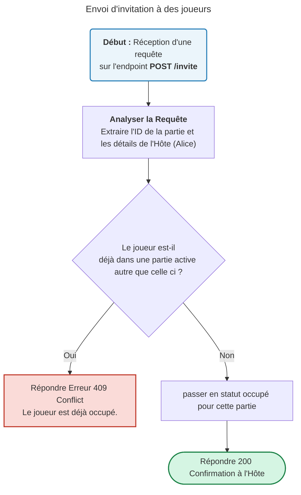
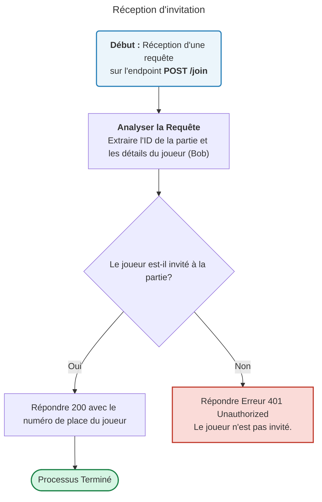
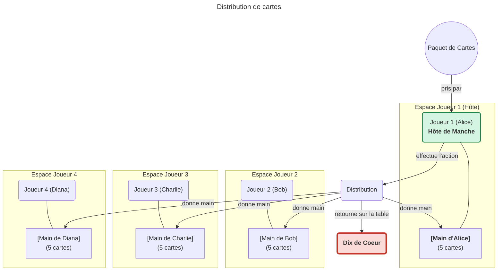
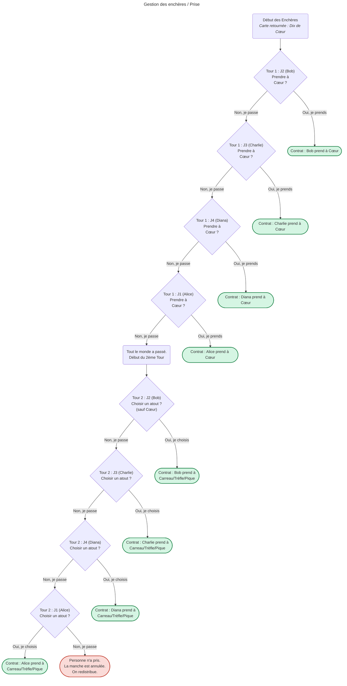
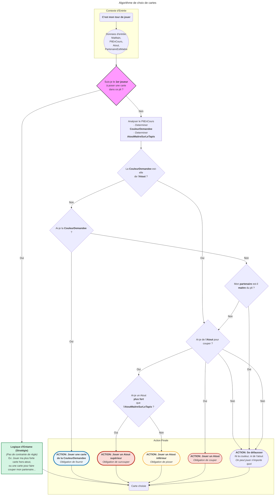
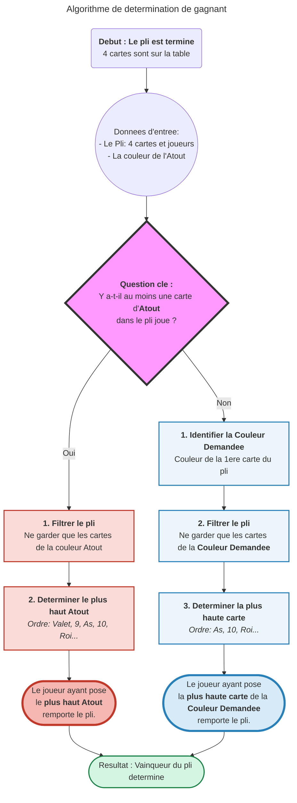
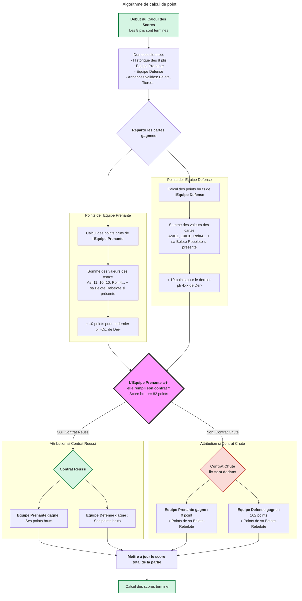

```mermaid
---
title: Diagramme de sequence global
---
sequenceDiagram
    participant Alice as Alice/Hôte
    participant Bob
    participant Charlie as Charlie/Preneur
    participant Diana
    rect rgb(168,168,168)
        loop personne n'a un score >500
        %% ======================= PHASE 0 : Proposition de partie (Alice) et inscription =======================
            rect rgb(192,168,192)
                Note over Alice: DEBUT DE PARTIE<br>Gère les inscription à la partie
                par
                    Alice ->> Bob: POST /invite
                    Note over Alice: Invite à la partie
                and
                    Alice ->> Charlie: POST /invite
                    Note over Alice: Invite à la partie
                and
                    Alice ->> Diana: POST /invite
                    Note over Alice: Invite à la partie
                end
                par
                    Bob ->> Alice: POST /join
                    Note over Alice: Envoie la position dans le jeu
                and
                    Charlie ->> Alice: POST /join
                    Note over Alice: Envoie la position dans le jeu
                and
                    Diana ->> Alice: POST /join
                    Note over Alice: Envoie la position dans le jeu
                end
                loop la partie n'est pas pleine
                    Alice ->> Alice: attend d'autre joueur
                end
                alt la partie est pleine
                    par
                        Alice ->> Bob: POST /join
                        Note over Alice: Envoie les joueurs et leur ip
                    and
                        Alice ->> Charlie: POST /join
                        Note over Alice: Envoie les joueurs et leur ip
                    and
                        Alice ->> Diana: POST /join
                        Note over Alice: Envoie les joueurs et leur ip
                    end
                end
            end

        %% ======================= PHASE 1 : DISTRIBUTION ET ENCHÈRES (Rôle Hôte) =======================
            rect rgb(168,192,192)
                Note over Alice: DEBUT DE MANCHE <br>Alice est Hôte.
                Alice ->> Alice: Mélange le paquet (uniquement pour la 1ère partie du jeu).
                Alice ->> Bob: POST /recevoir_main
                Alice ->> Charlie: POST /recevoir_main
                Alice ->> Diana: POST /recevoir_main
                Alice ->> Bob: POST /demander_enchere
                Bob -->> Alice: Réponse: { enchere: "PASSE" }
                Alice ->> Charlie: POST /demander_enchere
                Charlie -->> Alice: Réponse: { enchere: "PRENDS", couleur: "COEUR" }
            %%    Note over Alice: Enchères terminées. Charlie (Preneur) a pris à Coeur.
                Alice ->> Alice: Crée et signe l'action "RESULTAT_ENCHERES"
                Alice ->> Bob: POST /action (ActionSignee: Résultat)
                Alice ->> Charlie: POST /action (ActionSignee: Résultat)
                Alice ->> Diana: POST /action (ActionSignee: Résultat)
            %%    Note over Alice, Bob, Charlie, Diana: Synchronisation terminée. Atout = Coeur. Au tour de Bob de jouer.
            end
        %% ======================= PHASE 2 : JEU DES CARTES - UN PLI =======================
        %%  DÉBUT PHASE DE JEU - Le rôle d'Hôte est terminé pour Alice.
            rect rgb(192,192,168)
                loop Chaque pli tant qu'il reste une carte à jouer
                    note right of Bob: DEBUT DE PLI :<br> Bob lance le pli <br>(ou le dernier vainqueur du pli, ou le joueur après l hôte).
                    Bob ->> Bob: Choisit une carte, crée et signe une action "JOUER_CARTE"
                    par
                        Bob ->> Alice: POST /action (ActionSignee: Carte de Bob)
                        Note over Alice: Valide l action de Bob.
                    and
                        Bob ->> Charlie: POST /action (ActionSignee: Carte de Bob)
                        Note over Alice: Valide l action de Bob.
                    and
                        Bob ->> Diana: POST /action (ActionSignee: Carte de Bob)
                        Note over Alice: Valide l action de Bob.
                    end

                    Charlie ->> Charlie: Choisit une carte <br> crée et signe une action "JOUER_CARTE"
                    par
                        Charlie ->> Alice: POST /action (ActionSignee: Carte de Charlie)
                        Note over Alice: Valide l action de Charlie.
                    and
                        Charlie ->> Bob: POST /action (ActionSignee: Carte de Charlie)
                        Note over Bob: Valide l action de Charlie.
                    and
                        Charlie ->> Diana: POST /action (ActionSignee: Carte de Charlie)
                        Note over Diana: Valide l action de Charlie.
                    end

                    Diana ->> Diana: Choisit une carte, crée et signe une action "JOUER_CARTE"
                    par
                        Diana ->> Alice: POST /action (ActionSignee: Carte de Diana)
                        Note over Alice: Valide l action de Diana.
                    and
                        Diana ->> Bob: POST /action (ActionSignee: Carte de Diana)
                        Note over Bob: Valide l action de Diana.
                    and
                        Diana ->> Charlie: POST /action (ActionSignee: Carte de Diana)
                        Note over Charlie: Valide l action de Diana.
                    end

                    Alice ->> Alice: Choisit une carte, crée et signe une action "JOUER_CARTE"
                    par
                        Alice ->> Bob: POST /action (ActionSignee: Carte d'Alice)
                        Note over Bob: Valide l action d Alice.
                    and
                        Alice ->> Charlie: POST /action (ActionSignee: Carte d'Alice)
                        Note over Charlie: Valide l action d Alice.
                    and
                        Alice ->> Diana: POST /action (ActionSignee: Carte d'Alice)
                        Note over Diana: Valide l action d Alice.
                    end

                    alt le pli est complet
                        Note over Alice: FIN DE PLI <br>détermine le gagnant (Diana) crée et signe une action "REMPORTE_PLI"
                        par
                            Alice ->> Bob: POST /action (ActionSignee: Nom Vainqueur / Cartes Jouées)
                            Note over Bob: Valide la résolution d Alice.
                        and
                            Alice ->> Charlie: POST /action (ActionSignee: Nom Vainqueur / Cartes Jouées)
                            Note over Charlie: Valide la résolution d Alice.
                        and
                            Alice ->> Diana: POST /action (ActionSignee: Nom Vainqueur / Cartes Jouées)
                            Note over Diana: Valide la résolution d Alice <br> Enregistre les cartes gagnées.
                        end
                    end

                end
            end

        %% ======================= PHASE 3 : FIN DE MANCHE =======================
        %% Les 8 plis sont joués.
            rect rgb(192,192,192)
                Note over Alice: FIN DE MANCHE <br>Alice est Hôte.
                alt toutes les plis sont jouées
                    Alice ->> Alice: Calcul les points Crée et signe l'action "POINTS".
                    par
                        Alice ->> Bob: POST /action (ActionSignee: { type: "POINTS", points: X })
                        Note over Bob: Valide le comptage d Alice
                    and
                        Alice ->> Charlie: POST /action (ActionSignee: { type: "POINTS", points: Y })
                        Note over Charlie: Valide le comptage d Alice.
                    and
                        Alice ->> Diana: POST /action (ActionSignee: { type: "POINTS", points: X })
                        Note over Diana: Valide le comptage d Alice.
                    end
                    Alice ->> Alice: Choisit un point de coupe (ex: à la 12ème carte). Crée et signe l'action "COUPER_PAQUET".
                    par
                        Alice ->> Bob: POST /action (ActionSignee: { type: "COUPER_PAQUET", position: 12 })
                        Note over Bob: Valide la résolution d Alice
                    and
                        Alice ->> Charlie: POST /action (ActionSignee: { type: "COUPER_PAQUET", position: 12 })
                        Note over Charlie: Valide la résolution d Alice.
                    and
                        Alice ->> Diana: POST /action (ActionSignee: { type: "COUPER_PAQUET", position: 12 })
                        Note over Diana: Valide la résolution d Alice.
                    end
                end
                alt toutes les actions sont validées
                    Alice ->> Bob: POST /action (ActionSignee: { type: "JETON_HOTE"})
                    Note over Bob: prend le jeton HOTE et remplace Alice
                end
            end
        end
    end

    rect rgb(192,192,192)
        Note over Alice: FIN DE PARTIE <br>Alice est Hôte.
        alt une equipe depasse 500 points
            par
                Alice ->> Bob: POST /action (ActionSignee: { type: "RESULTATS", points par joueur })
                Note over Bob: Valide le comptage d Alice
            and
                Alice ->> Charlie: POST /action (ActionSignee: { type: "RESULTATS", points par joueur})
                Note over Charlie: Valide le comptage d Alice.
            and
                Alice ->> Diana: POST /action (ActionSignee: { type: "RESULTATS", points par joueur })
                Note over Diana: Valide le comptage d Alice.
            end
        end
        alt toutes les actions sont validées
            par
                Alice ->> Bob: POST /action (ActionSignee: { type: "FIN_PARTIE"})
                Note over Bob: prend le jeton HOTE et remplace Alice
            and
                Alice ->> Charlie: POST /action (ActionSignee: { type: "FIN_PARTIE"})
                Note over Charlie: prend le jeton HOTE et remplace Alice
            and
                Alice ->> Diana: POST /action (ActionSignee: { type: "FIN_PARTIE"})
                Note over Diana: prend le jeton HOTE et remplace Alice
            end
        end
    end

```

Basé sur https://fr.wikipedia.org/wiki/Belote

# Résumé

différents graphes et codes à comprendre / adapter pour coder le tout. 

```mermaid
---
title: Distribution du reste des cartes  
---
graph TD
%% --- Debut et Contexte ---
    Start("Debut de la 2ème phase de distribution<br/><b>Contexte:</b> Charlie (J3) a pris a Coeur")

%% --- Etape 1 : Le Preneur recupere la carte ---
    Start --> A["<b>Etape 1 :</b> Le Preneur (Charlie)<br/>reçoit la carte retournée"];
    A --> B((Etat : Preneur a 6 cartes, les autres ont 5<br/>Talon restant : 11 cartes));

%% --- Etape 2 : Distribution sequentielle du talon ---
    B --> C{"<b>Tour de Bob (J2)</b><br/>Est-ce le Preneur ?"};
    C -- Non --> D([Bob reçoit <b>3 cartes</b>]);

    D --> E{"<b>Tour de Charlie (J3)</b><br/>Est-ce le Preneur ?"};
    E -- Oui --> F([Charlie reçoit <b>2 cartes</b>]);

    F --> G{"<b>Tour de Diana (J4)</b><br/>Est-ce le Preneur ?"};
    G -- Non --> H([Diana reçoit <b>3 cartes</b>]);

    H --> I{"<b>Tour d'Alice (J1)</b><br/>Est-ce le Preneur ?"};
    I -- Non --> J([Alice reçoit <b>3 cartes</b>]);

%% --- Fin ---
    J --> Fin([<b>Distribution Terminée</b><br/>Le talon est vide.<br/>Tous les joueurs ont 8 cartes.]);

%% --- Styling ---
    style Start fill:#f9f,stroke:#333,stroke-width:2px
    style A fill:#EBF5FB,stroke:#3498DB,stroke-width:2px,font-weight:bold
    style F fill:#EBF5FB,stroke:#3498DB,stroke-width:4px,font-weight:bold

    style D fill:#FEF9E7,stroke:#F39C12,stroke-width:2px
    style H fill:#FEF9E7,stroke:#F39C12,stroke-width:2px
    style J fill:#FEF9E7,stroke:#F39C12,stroke-width:2px

    style Fin fill:#D5F5E3,stroke:#1D8348,stroke-width:2px
```















```yaml

{
  "id_partie": "a1b2c3d4-e5f6-4a7b-8c2d-123456789abc",
  "date_debut": "2025-06-04T00:10:00Z",
  "joueurs": [
    { "id_joueur": "J1", "nom": "Alice", "position": 1 },
    { "id_joueur": "J2", "nom": "Bob", "position": 2 },
    { "id_joueur": "J3", "nom": "Charlie", "position": 3 },
    { "id_joueur": "J4", "nom": "Diana", "position": 4 }
  ],
  "equipes": {
    "equipe_A": {
      "joueurs": [ "J1", "J3" ],
      "score_total": 122
    },
    "equipe_B": {
      "joueurs": [ "J2", "J4" ],
      "score_total": 60
    }
  },
  "manches": [
    {
      "numero_manche": 1,
      "dealer_position": 1,
      "paquet_initial_ordonne": [
        { "valeur": "AS", "couleur": "COEUR" }, { "valeur": "DIX", "couleur": "COEUR" }, { "valeur": "ROI", "couleur": "COEUR" },
        { "valeur": "AS", "couleur": "PIQUE" }, { "valeur": "SEPT", "couleur": "PIQUE" }, { "valeur": "VALET", "couleur": "PIQUE" },
        { "valeur": "DAME", "couleur": "PIQUE" }, { "valeur": "HUIT", "couleur": "PIQUE" }, { "valeur": "NEUF", "couleur": "CARREAU" },
        { "valeur": "VALET", "couleur": "CARREAU" }, { "valeur": "AS", "couleur": "CARREAU" }, { "valeur": "DIX", "couleur": "CARREAU" },
        { "valeur": "ROI", "couleur": "CARREAU" }, { "valeur": "SEPT", "couleur": "CARREAU" }, { "valeur": "HUIT", "couleur": "CARREAU" },
        { "valeur": "DAME", "couleur": "CARREAU" }, { "valeur": "DAME", "couleur": "COEUR" }, { "valeur": "VALET", "couleur": "COEUR" },
        { "valeur": "NEUF", "couleur": "COEUR" }, { "valeur": "SEPT", "couleur": "COEUR" }, { "valeur": "HUIT", "couleur": "COEUR" },
        { "valeur": "ROI", "couleur": "PIQUE" }, { "valeur": "NEUF", "couleur": "TREFLE" }, { "valeur": "VALET", "couleur": "TREFLE" },
        { "valeur": "SEPT", "couleur": "TREFLE" }, { "valeur": "HUIT", "couleur": "TREFLE" }, { "valeur": "DIX", "couleur": "TREFLE" },
        { "valeur": "AS", "couleur": "TREFLE" }, { "valeur": "ROI", "couleur": "TREFLE" }, { "valeur": "DAME", "couleur": "TREFLE" },
        { "valeur": "NEUF", "couleur": "PIQUE" }, { "valeur": "DIX", "couleur": "PIQUE" }
      ],
      "distribution": {
        "carte_retournee": { "valeur": "HUIT", "couleur": "COEUR" },
        "premier_tour": {
          "J1": [ { "valeur": "DAME", "couleur": "CARREAU" }, { "valeur": "DAME", "couleur": "COEUR" }, { "valeur": "VALET", "couleur": "COEUR" }, { "valeur": "NEUF", "couleur": "COEUR" }, { "valeur": "SEPT", "couleur": "COEUR" } ],
          "J2": [ { "valeur": "AS", "couleur": "COEUR" }, { "valeur": "DIX", "couleur": "COEUR" }, { "valeur": "ROI", "couleur": "COEUR" }, { "valeur": "AS", "couleur": "PIQUE" }, { "valeur": "SEPT", "couleur": "PIQUE" } ],
          "J3": [ { "valeur": "VALET", "couleur": "PIQUE" }, { "valeur": "DAME", "couleur": "PIQUE" }, { "valeur": "HUIT", "couleur": "PIQUE" }, { "valeur": "NEUF", "couleur": "CARREAU" }, { "valeur": "VALET", "couleur": "CARREAU" } ],
          "J4": [ { "valeur": "AS", "couleur": "CARREAU" }, { "valeur": "DIX", "couleur": "CARREAU" }, { "valeur": "ROI", "couleur": "CARREAU" }, { "valeur": "SEPT", "couleur": "CARREAU" }, { "valeur": "HUIT", "couleur": "CARREAU" } ]
        },
        "deuxieme_tour": {
          "J1": [ { "valeur": "NEUF", "couleur": "PIQUE" }, { "valeur": "DIX", "couleur": "PIQUE" }, { "valeur": "ROI", "couleur": "PIQUE" } ],
          "J2": [ { "valeur": "NEUF", "couleur": "TREFLE" }, { "valeur": "VALET", "couleur": "TREFLE" }, { "valeur": "SEPT", "couleur": "TREFLE" } ],
          "J3": [ { "valeur": "HUIT", "couleur": "TREFLE" }, { "valeur": "DIX", "couleur": "TREFLE" } ],
          "J4": [ { "valeur": "AS", "couleur": "TREFLE" }, { "valeur": "ROI", "couleur": "TREFLE" }, { "valeur": "DAME", "couleur": "TREFLE" } ]
        }
      },
      "contrat": {
        "preneur_id": "J1",
        "equipe_prenante": "A",
        "atout": "COEUR"
      },
      "plis": [
        { "numero_pli": 1, "meneur_id": "J2", "cartes_jouees": [ { "joueur_id": "J2", "carte": { "valeur": "AS", "couleur": "PIQUE" } }, { "joueur_id": "J3", "carte": { "valeur": "VALET", "couleur": "PIQUE" } }, { "joueur_id": "J4", "carte": { "valeur": "HUIT", "couleur": "CARREAU" } }, { "joueur_id": "J1", "carte": { "valeur": "ROI", "couleur": "PIQUE" } } ], "vainqueur_id": "J2" },
        { "numero_pli": 2, "meneur_id": "J2", "cartes_jouees": [ { "joueur_id": "J2", "carte": { "valeur": "SEPT", "couleur": "PIQUE" } }, { "joueur_id": "J3", "carte": { "valeur": "DAME", "couleur": "PIQUE" } }, { "joueur_id": "J4", "carte": { "valeur": "SEPT", "couleur": "CARREAU" } }, { "joueur_id": "J1", "carte": { "valeur": "NEUF", "couleur": "PIQUE" } } ], "vainqueur_id": "J1" },
        { "numero_pli": 3, "meneur_id": "J1", "cartes_jouees": [ { "joueur_id": "J1", "carte": { "valeur": "VALET", "couleur": "COEUR" } }, { "joueur_id": "J2", "carte": { "valeur": "SEPT", "couleur": "TREFLE" } }, { "joueur_id": "J3", "carte": { "valeur": "HUIT", "couleur": "PIQUE" } }, { "joueur_id": "J4", "carte": { "valeur": "AS", "couleur": "CARREAU" } } ], "vainqueur_id": "J1" },
        { "numero_pli": 4, "meneur_id": "J1", "cartes_jouees": [ { "joueur_id": "J1", "carte": { "valeur": "NEUF", "couleur": "COEUR" } }, { "joueur_id": "J2", "carte": { "valeur": "ROI", "couleur": "COEUR" } }, { "joueur_id": "J3", "carte": { "valeur": "NEUF", "couleur": "CARREAU" } }, { "joueur_id": "J4", "carte": { "valeur": "DIX", "couleur": "CARREAU" } } ], "vainqueur_id": "J1" },
        { "numero_pli": 5, "meneur_id": "J1", "cartes_jouees": [ { "joueur_id": "J1", "carte": { "valeur": "DAME", "couleur": "COEUR" } }, { "joueur_id": "J2", "carte": { "valeur": "AS", "couleur": "COEUR" } }, { "joueur_id": "J3", "carte": { "valeur": "VALET", "couleur": "CARREAU" } }, { "joueur_id": "J4", "carte": { "valeur": "ROI", "couleur": "CARREAU" } } ], "vainqueur_id": "J2" },
        { "numero_pli": 6, "meneur_id": "J2", "cartes_jouees": [ { "joueur_id": "J2", "carte": { "valeur": "DIX", "couleur": "COEUR" } }, { "joueur_id": "J3", "carte": { "valeur": "DIX", "couleur": "TREFLE" } }, { "joueur_id": "J4", "carte": { "valeur": "ROI", "couleur": "TREFLE" } }, { "joueur_id": "J1", "carte": { "valeur": "HUIT", "couleur": "COEUR" } } ], "vainqueur_id": "J2" },
        { "numero_pli": 7, "meneur_id": "J2", "cartes_jouees": [ { "joueur_id": "J2", "carte": { "valeur": "NEUF", "couleur": "TREFLE" } }, { "joueur_id": "J3", "carte": { "valeur": "HUIT", "couleur": "TREFLE" } }, { "joueur_id": "J4", "carte": { "valeur": "AS", "couleur": "TREFLE" } }, { "joueur_id": "J1", "carte": { "valeur": "DIX", "couleur": "PIQUE" } } ], "vainqueur_id": "J4" },
        { "numero_pli": 8, "meneur_id": "J4", "cartes_jouees": [ { "joueur_id": "J4", "carte": { "valeur": "DAME", "couleur": "TREFLE" } }, { "joueur_id": "J1", "carte": { "valeur": "DAME", "couleur": "CARREAU" } }, { "joueur_id": "J2", "carte": { "valeur": "VALET", "couleur": "TREFLE" } }, { "joueur_id": "J3", "carte": { "valeur": "DIX", "couleur": "CARREAU" } } ], "vainqueur_id": "J1" }
      ],
      "resultat_manche": {
        "contrat_reussi": true,
        "score_equipe_prenante": 102,
        "score_equipe_defense": 60,
      }
    }
  ],
  paquet_a_couper_pour_manche_suivante": [
// ====================================================================
// PARTIE 1: CARTES REMPORTÉES PAR L'ÉQUIPE A (gagnante du dernier pli)
// ====================================================================
// --- Cartes du pli n°2 (gagné par J1) ---
      { "valeur": "SEPT", "couleur": "PIQUE" },
    { "valeur": "DAME", "couleur": "PIQUE" },
    { "valeur": "SEPT", "couleur": "CARREAU" },
    { "valeur": "NEUF", "couleur": "PIQUE" },
// --- Cartes du pli n°3 (gagné par J1) ---
    { "valeur": "VALET", "couleur": "COEUR" },
    { "valeur": "SEPT", "couleur": "TREFLE" },
    { "valeur": "HUIT", "couleur": "PIQUE" },
    { "valeur": "AS", "couleur": "CARREAU" },
// --- Cartes du pli n°4 (gagné par J1) ---
    { "valeur": "NEUF", "couleur": "COEUR" },
    { "valeur": "ROI", "couleur": "COEUR" },
    { "valeur": "NEUF", "couleur": "CARREAU" },
    { "valeur": "DIX", "couleur": "CARREAU" },
// --- Cartes du pli n°8 (gagné par J1) ---
    { "valeur": "DAME", "couleur": "TREFLE" },
    { "valeur": "DAME", "couleur": "CARREAU" },
    { "valeur": "VALET", "couleur": "TREFLE" },
    { "valeur": "DIX", "couleur": "CARREAU" },
// ====================================================================
// PARTIE 2: CARTES REMPORTÉES PAR L'ÉQUIPE B (l'autre équipe)
// ====================================================================
// --- Cartes du pli n°1 (gagné par J2) ---
      { "valeur": "AS", "couleur": "PIQUE" },
    { "valeur": "VALET", "couleur": "PIQUE" },
    { "valeur": "HUIT", "couleur": "CARREAU" },
    { "valeur": "ROI", "couleur": "PIQUE" },
// --- Cartes du pli n°5 (gagné par J2) ---
    { "valeur": "DAME", "couleur": "COEUR" },
    { "valeur": "AS", "couleur": "COEUR" },
    { "valeur": "VALET", "couleur": "CARREAU" },
    { "valeur": "ROI", "couleur": "CARREAU" },
// --- Cartes du pli n°6 (gagné par J2) ---
    { "valeur": "DIX", "couleur": "COEUR" },
    { "valeur": "DIX", "couleur": "TREFLE" },
    { "valeur": "ROI", "couleur": "TREFLE" },
    { "valeur": "HUIT", "couleur": "COEUR" },
// --- Cartes du pli n°7 (gagné par J4) ---
    { "valeur": "NEUF", "couleur": "TREFLE" },
    { "valeur": "HUIT", "couleur": "TREFLE" },
    { "valeur": "AS", "couleur": "TREFLE" },
    { "valeur": "DIX", "couleur": "PIQUE" }
  ]
}
```

```python
import json

# --- Collez ici le JSON complet généré précédemment ---
json_data = """
{
  "id_partie": "a1b2c3d4-e5f6-4a7b-8c2d-123456789abc",
  "date_debut": "2025-06-04T00:10:00Z",
  "joueurs": [
    { "id_joueur": "J1", "nom": "Alice", "position": 1 },
    { "id_joueur": "J2", "nom": "Bob", "position": 2 },
    { "id_joueur": "J3", "nom": "Charlie", "position": 3 },
    { "id_joueur": "J4", "nom": "Diana", "position": 4 }
  ],
  "equipes": {
    "equipe_A": {
      "joueurs": ["J1", "J3"],
      "score_total": 122
    },
    "equipe_B": {
      "joueurs": ["J2", "J4"],
      "score_total": 60
    }
  },
  "manches": [
    {
      "numero_manche": 1,
      "dealer_position": 1,
      "paquet_initial_ordonne": [
        { "valeur": "AS", "couleur": "COEUR" }, { "valeur": "DIX", "couleur": "COEUR" }, { "valeur": "ROI", "couleur": "COEUR" },
        { "valeur": "AS", "couleur": "PIQUE" }, { "valeur": "SEPT", "couleur": "PIQUE" }, { "valeur": "VALET", "couleur": "PIQUE" },
        { "valeur": "DAME", "couleur": "PIQUE" }, { "valeur": "HUIT", "couleur": "PIQUE" }, { "valeur": "NEUF", "couleur": "CARREAU" },
        { "valeur": "VALET", "couleur": "CARREAU" }, { "valeur": "AS", "couleur": "CARREAU" }, { "valeur": "DIX", "couleur": "CARREAU" },
        { "valeur": "ROI", "couleur": "CARREAU" }, { "valeur": "SEPT", "couleur": "CARREAU" }, { "valeur": "HUIT", "couleur": "CARREAU" },
        { "valeur": "DAME", "couleur": "CARREAU" }, { "valeur": "DAME", "couleur": "COEUR" }, { "valeur": "VALET", "couleur": "COEUR" },
        { "valeur": "NEUF", "couleur": "COEUR" }, { "valeur": "SEPT", "couleur": "COEUR" }, { "valeur": "HUIT", "couleur": "COEUR" },
        { "valeur": "ROI", "couleur": "PIQUE" }, { "valeur": "NEUF", "couleur": "TREFLE" }, { "valeur": "VALET", "couleur": "TREFLE" },
        { "valeur": "SEPT", "couleur": "TREFLE" }, { "valeur": "HUIT", "couleur": "TREFLE" }, { "valeur": "DIX", "couleur": "TREFLE" },
        { "valeur": "AS", "couleur": "TREFLE" }, { "valeur": "ROI", "couleur": "TREFLE" }, { "valeur": "DAME", "couleur": "TREFLE" },
        { "valeur": "NEUF", "couleur": "PIQUE" }, { "valeur": "DIX", "couleur": "PIQUE" }
      ],
      "distribution": {
        "carte_retournee": { "valeur": "HUIT", "couleur": "COEUR" },
        "premier_tour": {
          "J1": [ { "valeur": "DAME", "couleur": "CARREAU" }, { "valeur": "DAME", "couleur": "COEUR" }, { "valeur": "VALET", "couleur": "COEUR" }, { "valeur": "NEUF", "couleur": "COEUR" }, { "valeur": "SEPT", "couleur": "COEUR" } ],
          "J2": [ { "valeur": "AS", "couleur": "COEUR" }, { "valeur": "DIX", "couleur": "COEUR" }, { "valeur": "ROI", "couleur": "COEUR" }, { "valeur": "AS", "couleur": "PIQUE" }, { "valeur": "SEPT", "couleur": "PIQUE" } ],
          "J3": [ { "valeur": "VALET", "couleur": "PIQUE" }, { "valeur": "DAME", "couleur": "PIQUE" }, { "valeur": "HUIT", "couleur": "PIQUE" }, { "valeur": "NEUF", "couleur": "CARREAU" }, { "valeur": "VALET", "couleur": "CARREAU" } ],
          "J4": [ { "valeur": "AS", "couleur": "CARREAU" }, { "valeur": "DIX", "couleur": "CARREAU" }, { "valeur": "ROI", "couleur": "CARREAU" }, { "valeur": "SEPT", "couleur": "CARREAU" }, { "valeur": "HUIT", "couleur": "CARREAU" } ]
        },
        "deuxieme_tour": {
          "J1": [ { "valeur": "NEUF", "couleur": "PIQUE" }, { "valeur": "DIX", "couleur": "PIQUE" }, { "valeur": "ROI", "couleur": "PIQUE" } ],
          "J2": [ { "valeur": "NEUF", "couleur": "TREFLE" }, { "valeur": "VALET", "couleur": "TREFLE" }, { "valeur": "SEPT", "couleur": "TREFLE" } ],
          "J3": [ { "valeur": "HUIT", "couleur": "TREFLE" }, { "valeur": "DIX", "couleur": "TREFLE" } ],
          "J4": [ { "valeur": "AS", "couleur": "TREFLE" }, { "valeur": "ROI", "couleur": "TREFLE" }, { "valeur": "DAME", "couleur": "TREFLE" } ]
        }
      },
      "contrat": {
        "preneur_id": "J1",
        "equipe_prenante": "A",
        "atout": "COEUR"
      },
      "plis": [
        { "numero_pli": 1, "meneur_id": "J2", "cartes_jouees": [ { "joueur_id": "J2", "carte": { "valeur": "AS", "couleur": "PIQUE" } }, { "joueur_id": "J3", "carte": { "valeur": "VALET", "couleur": "PIQUE" } }, { "joueur_id": "J4", "carte": { "valeur": "HUIT", "couleur": "CARREAU" } }, { "joueur_id": "J1", "carte": { "valeur": "ROI", "couleur": "PIQUE" } } ], "vainqueur_id": "J2" },
        { "numero_pli": 2, "meneur_id": "J2", "cartes_jouees": [ { "joueur_id": "J2", "carte": { "valeur": "SEPT", "couleur": "PIQUE" } }, { "joueur_id": "J3", "carte": { "valeur": "DAME", "couleur": "PIQUE" } }, { "joueur_id": "J4", "carte": { "valeur": "SEPT", "couleur": "CARREAU" } }, { "joueur_id": "J1", "carte": { "valeur": "NEUF", "couleur": "PIQUE" } } ], "vainqueur_id": "J1" },
        { "numero_pli": 3, "meneur_id": "J1", "cartes_jouees": [ { "joueur_id": "J1", "carte": { "valeur": "VALET", "couleur": "COEUR" } }, { "joueur_id": "J2", "carte": { "valeur": "SEPT", "couleur": "TREFLE" } }, { "joueur_id": "J3", "carte": { "valeur": "HUIT", "couleur": "PIQUE" } }, { "joueur_id": "J4", "carte": { "valeur": "AS", "couleur": "CARREAU" } } ], "vainqueur_id": "J1" },
        { "numero_pli": 4, "meneur_id": "J1", "cartes_jouees": [ { "joueur_id": "J1", "carte": { "valeur": "NEUF", "couleur": "COEUR" } }, { "joueur_id": "J2", "carte": { "valeur": "ROI", "couleur": "COEUR" } }, { "joueur_id": "J3", "carte": { "valeur": "NEUF", "couleur": "CARREAU" } }, { "joueur_id": "J4", "carte": { "valeur": "DIX", "couleur": "CARREAU" } } ], "vainqueur_id": "J1" },
        { "numero_pli": 5, "meneur_id": "J1", "cartes_jouees": [ { "joueur_id": "J1", "carte": { "valeur": "DAME", "couleur": "COEUR" } }, { "joueur_id": "J2", "carte": { "valeur": "AS", "couleur": "COEUR" } }, { "joueur_id": "J3", "carte": { "valeur": "VALET", "couleur": "CARREAU" } }, { "joueur_id": "J4", "carte": { "valeur": "ROI", "couleur": "CARREAU" } } ], "vainqueur_id": "J2" },
        { "numero_pli": 6, "meneur_id": "J2", "cartes_jouees": [ { "joueur_id": "J2", "carte": { "valeur": "DIX", "couleur": "COEUR" } }, { "joueur_id": "J3", "carte": { "valeur": "DIX", "couleur": "TREFLE" } }, { "joueur_id": "J4", "carte": { "valeur": "ROI", "couleur": "TREFLE" } }, { "joueur_id": "J1", "carte": { "valeur": "HUIT", "couleur": "COEUR" } } ], "vainqueur_id": "J2" },
        { "numero_pli": 7, "meneur_id": "J2", "cartes_jouees": [ { "joueur_id": "J2", "carte": { "valeur": "NEUF", "couleur": "TREFLE" } }, { "joueur_id": "J3", "carte": { "valeur": "HUIT", "couleur": "TREFLE" } }, { "joueur_id": "J4", "carte": { "valeur": "AS", "couleur": "TREFLE" } }, { "joueur_id": "J1", "carte": { "valeur": "DIX", "couleur": "PIQUE" } } ], "vainqueur_id": "J4" },
        { "numero_pli": 8, "meneur_id": "J4", "cartes_jouees": [ { "joueur_id": "J4", "carte": { "valeur": "DAME", "couleur": "TREFLE" } }, { "joueur_id": "J1", "carte": { "valeur": "DAME", "couleur": "CARREAU" } }, { "joueur_id": "J2", "carte": { "valeur": "VALET", "couleur": "TREFLE" } }, { "joueur_id": "J3", "carte": { "valeur": "DIX", "couleur": "CARREAU" } } ], "vainqueur_id": "J1" }
      ],
      "resultat_manche": {
        "contrat_reussi": true,
        "score_equipe_prenante": 122,
        "score_equipe_defense": 60,
        "annonces": [
            { "joueur_id": "J1", "type": "BELOTE-REBELOTE", "valeur": 20 }
        ]
      }
    }
  ]
}
"""

# --- Définition des Constantes et Classes Utilitaires ---

POINTS_ATOUT = {"VALET": 20, "NEUF": 14, "AS": 11, "DIX": 10, "ROI": 4, "DAME": 3, "HUIT": 0, "SEPT": 0}
POINTS_NORMAL = {"AS": 11, "DIX": 10, "ROI": 4, "DAME": 3, "VALET": 2, "NEUF": 0, "HUIT": 0, "SEPT": 0}

class Carte:
    """Représente une carte à jouer pour faciliter les comparaisons."""
    def __init__(self, data_dict):
        self.valeur = data_dict['valeur']
        self.couleur = data_dict['couleur']

    def __repr__(self):
        return f"{self.valeur} de {self.couleur}"

    def get_points(self, atout):
        """Retourne la valeur en points de la carte."""
        if self.couleur == atout:
            return POINTS_ATOUT[self.valeur]
        return POINTS_NORMAL[self.valeur]

class TesteurDeManche:
    """Classe principale pour charger et tester les données d'une manche."""

    def __init__(self, data_partie, numero_manche=1):
        self.partie = data_partie
        self.manche = self.partie['manches'][numero_manche - 1]
        self.atout = self.manche['contrat']['atout']
        self.equipe_prenante_id = self.manche['contrat']['equipe_prenante']
        self.equipe_defense_id = 'B' if self.equipe_prenante_id == 'A' else 'A'
        self.joueurs_equipe_prenante = self.partie['equipes'][self.equipe_prenante_id]['joueurs']
        self.joueurs_equipe_defense = self.partie['equipes'][self.equipe_defense_id]['joueurs']
        
        print("="*50)
        print(f"LANCEMENT DES TESTS POUR LA MANCHE {self.manche['numero_manche']}")
        print(f"Equipe Prenante: {self.equipe_prenante_id} ({self.joueurs_equipe_prenante})")
        print(f"Atout: {self.atout}")
        print("="*50)


    def lancer_les_tests(self):
        """Lance l'ensemble des tests."""
        self.verifier_scores()
        self.verifier_legalite_des_plis()

    def verifier_scores(self):
        """Recalcule le score à partir des plis et le compare au score enregistré."""
        print("\n--- TEST 1: Vérification des Scores ---")
        
        points_bruts_prenants = 0
        points_bruts_defense = 0

        # Etape 1: Calculer les points bruts de chaque pli
        for pli in self.manche['plis']:
            points_du_pli = sum(Carte(c['carte']).get_points(self.atout) for c in pli['cartes_jouees'])
            
            if pli['vainqueur_id'] in self.joueurs_equipe_prenante:
                points_bruts_prenants += points_du_pli
            else:
                points_bruts_defense += points_du_pli
        
        # Etape 2: Ajouter le Dix de Der
        vainqueur_dernier_pli = self.manche['plis'][-1]['vainqueur_id']
        if vainqueur_dernier_pli in self.joueurs_equipe_prenante:
            points_bruts_prenants += 10
        else:
            points_bruts_defense += 10

        # Etape 3: Calculer les points d'annonces
        points_annonces_prenants = sum(a['valeur'] for a in self.manche['annonces'] if a['joueur_id'] in self.joueurs_equipe_prenante)
        points_annonces_defense = sum(a['valeur'] for a in self.manche['annonces'] if a['joueur_id'] in self.joueurs_equipe_defense)

        # Etape 4: Vérifier le contrat et attribuer les scores finaux
        contrat_reussi_calcule = points_bruts_prenants >= 82
        
        score_final_prenant_calcule = 0
        score_final_defense_calcule = 0

        if contrat_reussi_calcule:
            score_final_prenant_calcule = points_bruts_prenants + points_annonces_prenants + points_annonces_defense
            score_final_defense_calcule = points_bruts_defense
        else: # Contrat chuté
            # La belote est acquise même si on chute
            belote_prenante = sum(a['valeur'] for a in self.manche['annonces'] if a['joueur_id'] in self.joueurs_equipe_prenante and a['type'] == 'BELOTE-REBELOTE')
            score_final_prenant_calcule = belote_prenante
            score_final_defense_calcule = 162 + points_annonces_prenants + points_annonces_defense

        # Etape 5: Comparer avec les données du JSON
        resultat_json = self.manche['resultat_manche']
        print(f"Score Preneur (JSON): {resultat_json['score_equipe_prenante']} / Score Défense (JSON): {resultat_json['score_equipe_defense']}")
        print(f"Score Preneur (Calculé): {score_final_prenant_calcule} / Score Défense (Calculé): {score_final_defense_calcule}")

        if (resultat_json['score_equipe_prenante'] == score_final_prenant_calcule and
            resultat_json['score_equipe_defense'] == score_final_defense_calcule):
            print(">> RÉSULTAT: [OK] Les scores correspondent.")
        else:
            print(">> RÉSULTAT: [ERREUR] Les scores ne correspondent pas !")

    def verifier_legalite_des_plis(self):
        """Vérifie que chaque carte jouée était un coup légal."""
        print("\n--- TEST 2: Vérification de la Légalité des Plis ---")
        
        # Etape 1: Reconstituer les mains initiales de chaque joueur
        mains = {}
        for joueur_id, cartes in self.manche['distribution']['premier_tour'].items():
            mains[joueur_id] = [Carte(c) for c in cartes]
        for joueur_id, cartes in self.manche['distribution']['deuxieme_tour'].items():
            mains[joueur_id].extend([Carte(c) for c in cartes])
        
        # Ajout de la carte retournée au preneur
        preneur_id = self.manche['contrat']['preneur_id']
        carte_retournee = Carte(self.manche['distribution']['carte_retournee'])
        mains[preneur_id].append(carte_retournee)

        # Etape 2: Parcourir chaque pli et chaque coup
        for pli in self.manche['plis']:
            print(f"  Vérification du Pli N°{pli['numero_pli']}")
            pli_en_cours_pour_validation = []
            couleur_demandee = None

            for coup in pli['cartes_jouees']:
                joueur_id = coup['joueur_id']
                carte_jouee = Carte(coup['carte'])
                
                # --- Logique de validation du coup ---
                # TODO: C'est ici que l'algorithme complexe de validation doit être implémenté.
                # Il faut vérifier les règles (fournir, couper, surcouper, etc.)
                # en se basant sur la main du joueur à ce moment, l'atout,
                # et les cartes déjà dans pli_en_cours_pour_validation.
                
                coup_legal = self.valider_coup(carte_jouee, mains[joueur_id], pli_en_cours_pour_validation, self.atout)
                
                if not coup_legal:
                    print(f"    >> [ERREUR] Coup illégal détecté pour {joueur_id} qui a joué {carte_jouee} !")
                    # On pourrait arrêter le test ici si on le souhaite
                
                # Mettre à jour les etats pour le coup suivant
                pli_en_cours_pour_validation.append(carte_jouee)
                # Retirer la carte de la main du joueur pour simuler l'avancement
                # Note: une vraie implémentation nécessite de comparer les objets Carte correctement
                mains[joueur_id] = [c for c in mains[joueur_id] if not (c.valeur == carte_jouee.valeur and c.couleur == carte_jouee.couleur)]

        print(">> RÉSULTAT: Vérification de la légalité terminée.")

    def valider_coup(self, carte_jouee, main_du_joueur, pli_en_cours, atout):
        """
        Une fonction qui devrait contenir l'algorithme de validation de coup.
        C'est le "cerveau" de la vérification des règles.
        """
        # TODO: Implémenter la logique du diagramme "Quelle Carte Jouer ?"
        # 1. Vérifier si le joueur est le premier à jouer. Si oui, tout coup est légal.
        # 2. Sinon, déterminer la couleur demandée.
        # 3. Vérifier si le joueur a la couleur demandée. Si oui, a-t-il joué cette couleur ?
        # 4. S'il n'a pas la couleur, a-t-il coupé alors qu'il le devait/pouvait ?
        # 5. A-t-il surcoupé si nécessaire ?
        # ...etc.
        
        # Pour ce canevas, nous retournons toujours True.
        return True


# --- Point d'Entrée du Script ---
if __name__ == "__main__":
    donnees_de_la_partie = json.loads(json_data)
    testeur = TesteurDeManche(donnees_de_la_partie, numero_manche=1)
    testeur.lancer_les_tests()
```


