```mermaid
---
title: Diagramme de sequence global
---
sequenceDiagram
    participant Alice as Alice/Hôte
    participant Bob
    participant Charlie as Charlie/Preneur
    participant Diana
    rect rgb(168,168,168)
        loop personne n'a un score >500
        %% ======================= PHASE 0 : Proposition de partie (Alice) et inscription =======================
            rect rgb(192,168,192)
                Note over Alice: DEBUT DE PARTIE<br>Gère les inscription à la partie
                par
                    Alice ->> Bob: POST /invite
                    Note over Alice: Invite à la partie
                and
                    Alice ->> Charlie: POST /invite
                    Note over Alice: Invite à la partie
                and
                    Alice ->> Diana: POST /invite
                    Note over Alice: Invite à la partie
                end
                par
                    Bob ->> Alice: POST /join
                    Note over Alice: Envoie la position dans le jeu
                and
                    Charlie ->> Alice: POST /join
                    Note over Alice: Envoie la position dans le jeu
                and
                    Diana ->> Alice: POST /join
                    Note over Alice: Envoie la position dans le jeu
                end
                loop la partie n'est pas pleine
                    Alice ->> Alice: attend d'autre joueur
                end
                alt la partie est pleine
                    par
                        Alice ->> Bob: POST /join
                        Note over Alice: Envoie les joueurs et leur ip
                    and
                        Alice ->> Charlie: POST /join
                        Note over Alice: Envoie les joueurs et leur ip
                    and
                        Alice ->> Diana: POST /join
                        Note over Alice: Envoie les joueurs et leur ip
                    end
                end
            end

        %% ======================= PHASE 1 : DISTRIBUTION ET ENCHÈRES (Rôle Hôte) =======================
            rect rgb(168,192,192)
                Note over Alice: DEBUT DE MANCHE <br>Alice est Hôte.
                Alice ->> Alice: Mélange le paquet (uniquement pour la 1ère partie du jeu).
                Alice ->> Bob: POST /recevoir_main
                Alice ->> Charlie: POST /recevoir_main
                Alice ->> Diana: POST /recevoir_main
                Alice ->> Bob: POST /demander_enchere
                Bob -->> Alice: Réponse: { enchere: "PASSE" }
                Alice ->> Charlie: POST /demander_enchere
                Charlie -->> Alice: Réponse: { enchere: "PRENDS", couleur: "COEUR" }
            %%    Note over Alice: Enchères terminées. Charlie (Preneur) a pris à Coeur.
                Alice ->> Alice: Crée et signe l'action "RESULTAT_ENCHERES"
                Alice ->> Bob: POST /action (ActionSignee: Résultat)
                Alice ->> Charlie: POST /action (ActionSignee: Résultat)
                Alice ->> Diana: POST /action (ActionSignee: Résultat)
            %%    Note over Alice, Bob, Charlie, Diana: Synchronisation terminée. Atout = Coeur. Au tour de Bob de jouer.
            end
        %% ======================= PHASE 2 : JEU DES CARTES - UN PLI =======================
        %%  DÉBUT PHASE DE JEU - Le rôle d'Hôte est terminé pour Alice.
            rect rgb(192,192,168)
                loop Chaque pli tant qu'il reste une carte à jouer
                    note right of Bob: DEBUT DE PLI :<br> Bob lance le pli <br>(ou le dernier vainqueur du pli, ou le joueur après l hôte).
                    Bob ->> Bob: Choisit une carte, crée et signe une action "JOUER_CARTE"
                    par
                        Bob ->> Alice: POST /action (ActionSignee: Carte de Bob)
                        Note over Alice: Valide l action de Bob.
                    and
                        Bob ->> Charlie: POST /action (ActionSignee: Carte de Bob)
                        Note over Alice: Valide l action de Bob.
                    and
                        Bob ->> Diana: POST /action (ActionSignee: Carte de Bob)
                        Note over Alice: Valide l action de Bob.
                    end

                    Charlie ->> Charlie: Choisit une carte <br> crée et signe une action "JOUER_CARTE"
                    par
                        Charlie ->> Alice: POST /action (ActionSignee: Carte de Charlie)
                        Note over Alice: Valide l action de Charlie.
                    and
                        Charlie ->> Bob: POST /action (ActionSignee: Carte de Charlie)
                        Note over Bob: Valide l action de Charlie.
                    and
                        Charlie ->> Diana: POST /action (ActionSignee: Carte de Charlie)
                        Note over Diana: Valide l action de Charlie.
                    end

                    Diana ->> Diana: Choisit une carte, crée et signe une action "JOUER_CARTE"
                    par
                        Diana ->> Alice: POST /action (ActionSignee: Carte de Diana)
                        Note over Alice: Valide l action de Diana.
                    and
                        Diana ->> Bob: POST /action (ActionSignee: Carte de Diana)
                        Note over Bob: Valide l action de Diana.
                    and
                        Diana ->> Charlie: POST /action (ActionSignee: Carte de Diana)
                        Note over Charlie: Valide l action de Diana.
                    end

                    Alice ->> Alice: Choisit une carte, crée et signe une action "JOUER_CARTE"
                    par
                        Alice ->> Bob: POST /action (ActionSignee: Carte d'Alice)
                        Note over Bob: Valide l action d Alice.
                    and
                        Alice ->> Charlie: POST /action (ActionSignee: Carte d'Alice)
                        Note over Charlie: Valide l action d Alice.
                    and
                        Alice ->> Diana: POST /action (ActionSignee: Carte d'Alice)
                        Note over Diana: Valide l action d Alice.
                    end

                    alt le pli est complet
                        Note over Alice: FIN DE PLI <br>détermine le gagnant (Diana) crée et signe une action "REMPORTE_PLI"
                        par
                            Alice ->> Bob: POST /action (ActionSignee: Nom Vainqueur / Cartes Jouées)
                            Note over Bob: Valide la résolution d Alice.
                        and
                            Alice ->> Charlie: POST /action (ActionSignee: Nom Vainqueur / Cartes Jouées)
                            Note over Charlie: Valide la résolution d Alice.
                        and
                            Alice ->> Diana: POST /action (ActionSignee: Nom Vainqueur / Cartes Jouées)
                            Note over Diana: Valide la résolution d Alice <br> Enregistre les cartes gagnées.
                        end
                    end

                end
            end

        %% ======================= PHASE 3 : FIN DE MANCHE =======================
        %% Les 8 plis sont joués.
            rect rgb(192,192,192)
                Note over Alice: FIN DE MANCHE <br>Alice est Hôte.
                alt toutes les plis sont jouées
                    Alice ->> Alice: Calcul les points Crée et signe l'action "POINTS".
                    par
                        Alice ->> Bob: POST /action (ActionSignee: { type: "POINTS", points: X })
                        Note over Bob: Valide le comptage d Alice
                    and
                        Alice ->> Charlie: POST /action (ActionSignee: { type: "POINTS", points: Y })
                        Note over Charlie: Valide le comptage d Alice.
                    and
                        Alice ->> Diana: POST /action (ActionSignee: { type: "POINTS", points: X })
                        Note over Diana: Valide le comptage d Alice.
                    end
                    Alice ->> Alice: Choisit un point de coupe (ex: à la 12ème carte). Crée et signe l'action "COUPER_PAQUET".
                    par
                        Alice ->> Bob: POST /action (ActionSignee: { type: "COUPER_PAQUET", position: 12 })
                        Note over Bob: Valide la résolution d Alice
                    and
                        Alice ->> Charlie: POST /action (ActionSignee: { type: "COUPER_PAQUET", position: 12 })
                        Note over Charlie: Valide la résolution d Alice.
                    and
                        Alice ->> Diana: POST /action (ActionSignee: { type: "COUPER_PAQUET", position: 12 })
                        Note over Diana: Valide la résolution d Alice.
                    end
                end
                alt toutes les actions sont validées
                    Alice ->> Bob: POST /action (ActionSignee: { type: "JETON_HOTE"})
                    Note over Bob: prend le jeton HOTE et remplace Alice
                end
            end
        end
    end

    rect rgb(192,192,192)
        Note over Alice: FIN DE PARTIE <br>Alice est Hôte.
        alt une equipe depasse 500 points
            par
                Alice ->> Bob: POST /action (ActionSignee: { type: "RESULTATS", points par joueur })
                Note over Bob: Valide le comptage d Alice
            and
                Alice ->> Charlie: POST /action (ActionSignee: { type: "RESULTATS", points par joueur})
                Note over Charlie: Valide le comptage d Alice.
            and
                Alice ->> Diana: POST /action (ActionSignee: { type: "RESULTATS", points par joueur })
                Note over Diana: Valide le comptage d Alice.
            end
        end
        alt toutes les actions sont validées
            par
                Alice ->> Bob: POST /action (ActionSignee: { type: "FIN_PARTIE"})
                Note over Bob: prend le jeton HOTE et remplace Alice
            and
                Alice ->> Charlie: POST /action (ActionSignee: { type: "FIN_PARTIE"})
                Note over Charlie: prend le jeton HOTE et remplace Alice
            and
                Alice ->> Diana: POST /action (ActionSignee: { type: "FIN_PARTIE"})
                Note over Diana: prend le jeton HOTE et remplace Alice
            end
        end
    end

```

Basé sur https://fr.wikipedia.org/wiki/Belote

# Belote P2P pour IA (avec Tests)

L'objectif final est de créer un système où quatre processus IA indépendants peuvent jouer une partie de belote complète en P2P, avec un code structuré pour que le développeur puisse facilement créer, tester et améliorer de nouvelles IA. Une culture de test est intégrée dès le début.


## Module 1 : Le Moteur de Jeu Local et l'IA de Base (Programmation Procédurale)

**Objectif :** Valider toute la logique du jeu de belote dans un unique script Python qui simule une partie complète entre 4 IA basiques, en utilisant des tests unitaires pour chaque composant.


### Étape 1.1 : Représentation des Données

- **Implémentation :** Définir une carte comme un dictionnaire : {'valeur': 'AS', 'couleur': 'COEUR'}. Créer des listes pour les mains et le paquet.

- **Fonctions Utilitaires :** creer\_paquet(), melanger\_paquet(paquet).


### Étape 1.2 : Les Briques Logiques Élémentaires

- **Implémentation :** Créer les fonctions get\_points\_carte(carte, atout) et determiner\_vainqueur\_pli(pli\_cartes, atout, couleur\_demandee).

- 🧪 **Tests à Implémenter (pytest) :**

* **Pour get\_points\_carte :**

- test\_points\_valet\_atout() : Vérifie que le Valet d'atout retourne bien 20 points.

- test\_points\_neuf\_atout() : Vérifie que le 9 d'atout retourne bien 14 points.

- test\_points\_as\_normal() : Vérifie qu'un As non-atout retourne bien 11 points.

- test\_points\_valet\_normal() : Vérifie que le Valet non-atout retourne bien 2 points.

* **Pour determiner\_vainqueur\_pli :**

- test\_vainqueur\_avec\_un\_seul\_atout() : Un pli avec 3 cartes normales et 1 atout ; le joueur de l'atout gagne.

- test\_vainqueur\_avec\_plusieurs\_atouts\_meme\_couleur() : Un pli avec un 9 d'atout et un Valet d'atout ; le joueur du Valet gagne.

- test\_vainqueur\_sans\_atout\_couleur\_demandee() : Un pli sans atout ; le joueur avec l'As de la couleur demandée gagne contre le 10.

- test\_vainqueur\_avec\_defausse\_non\_atout() : Un joueur ne fournit pas la couleur demandée et se défausse d'une autre couleur (non atout) ; il ne peut pas gagner.


### Étape 1.3 : L'IA Minimale (Le Cerveau à Tester)

- **Implémentation :** Créer la fonction choisir\_carte\_legale(main\_joueur, pli\_en\_cours, atout, partenaire\_maitre). Cette fonction doit retourner une carte légale à jouer. Si plusieurs sont possibles, elle peut choisir la première ou une au hasard pour l'instant.

- 🧪 **Tests à Implémenter (pytest) :**

* test\_ia\_doit\_fournir\_la\_couleur\_si\_possible() : Donner une main où le joueur peut fournir ; vérifier que la carte jouée est de la couleur demandée.

* test\_ia\_doit\_couper\_si\_possible() : Le joueur n'a pas la couleur demandée mais a de l'atout ; vérifier qu'il joue un atout.

* test\_ia\_doit\_surcouper\_atout\_si\_possible() : Un adversaire a coupé avec un atout. Donner à l'IA un atout supérieur ; vérifier qu'elle surcoupe.

* test\_ia\_peut\_pisser\_atout\_si\_pas\_mieux() : Atout demandé, l'IA n'a que des atouts inférieurs ; vérifier qu'elle joue un atout.

* test\_ia\_peut\_se\_defausser\_si\_partenaire\_maitre() : Le partenaire de l'IA est maître. L'IA n'a pas la couleur demandée et n'est pas obligée de couper ; vérifier qu'elle peut jouer une autre carte.

* test\_ia\_se\_defausse\_si\_ni\_couleur\_ni\_atout() : L'IA ne peut ni fournir ni couper ; vérifier qu'elle joue une carte d'une autre couleur.


### Étape 1.4 : La Logique d'Enchères et de Score de Manche

- **Implémentation :** Créer les fonctions decider\_enchere(main\_joueur, carte\_retournee) (pour l'instant, décision simple : prendre si > X points d'atout potentiels) et calculer\_scores\_manche(equipe\_prenante\_points\_bruts, equipe\_defense\_points\_bruts, annonces\_prenantes, annonces\_defense, equipe\_prenante\_belote, contrat\_reussi).

- 🧪 **Tests à Implémenter (pytest) :**

* test\_score\_contrat\_reussi\_simple() : L'équipe prenante fait 100 points bruts (sans annonces) ; vérifier que le score attribué est 100 pour les prenants, 62 pour la défense.

* test\_score\_contrat\_chute\_simple() : L'équipe prenante fait 70 points bruts (sans annonces) ; vérifier qu'elle marque 0 et la défense 162.

* test\_score\_contrat\_reussi\_avec\_annonces() : Prenants font 90, annoncent 20 (Belote). Défense fait 72. Prenants marquent 90+20=110. Défense marque 72.

* test\_score\_contrat\_chute\_avec\_annonces() : Prenants font 60, annoncent 20 (Belote). Défense annonce 50. Prenants marquent 20 (Belote). Défense marque 162 + 50 = 212.

* test\_decider\_enchere\_prend\_avec\_bonne\_main() : Donner une main forte à l'IA pour les enchères ; vérifier qu'elle décide de "prendre".

* test\_decider\_enchere\_passe\_avec\_mauvaise\_main() : Donner une main faible ; vérifier qu'elle "passe".

**Victoire de ce Module :** Vous avez un fichier simulation\_locale.py qui simule une partie complète entre 4 IA basiques et affiche le score final. Tous vos tests unitaires pour la logique de base passent.


## Module 2 : Structuration du Code pour des IA Améliorables (Programmation Orientée Objet)

**Objectif :** Rendre le code modulaire et propre en utilisant la POO, afin de pouvoir facilement "brancher" différentes versions de l'IA. Le jeu doit faire exactement la même chose, mais le code est mieux organisé.


### Étape 2.1 & 2.2 : Les Classes de Données et la Classe JoueurIA

- **Implémentation :** Créer les classes Carte, Paquet, Equipe. Créer une classe de base JoueurIA (potentiellement abstraite) et des implémentations concrètes : JoueurIAAleatoire(JoueurIA) (joue un coup légal au hasard) et JoueurIASimple(JoueurIA) (reprend la logique de choisir\_carte\_legale et decider\_enchere du Module 1).

- 🧪 **Tests à Adapter et à Implémenter :**

* Réécrire tous les tests du Module 1 pour utiliser les objets. Par exemple, get\_points\_carte(carte\_dict, atout) devient carte\_objet.get\_points(atout). Le test test\_points\_valet\_atout doit maintenant instancier un objet Carte.

* Exemple : Les tests de légalité appellent maintenant la méthode joueur\_ia.choisir\_carte(...).

* test\_joueur\_ia\_aleatoire\_joue\_coup\_legal() : Vérifier que JoueurIAAleatoire retourne bien une carte parmi les coups légaux possibles.

* test\_joueur\_ia\_simple\_respecte\_regles() : Refaire les tests de légalité du Module 1, mais en appelant la méthode de JoueurIASimple.


### Étape 2.3 : La Classe Moteur de Jeu Partie

- **Implémentation :** Créer la classe Partie qui orchestre le jeu. Elle prend en entrée une liste de 4 objets JoueurIA.

- 🧪 **Tests d'Intégration à Implémenter :**

* test\_partie\_avec\_differentes\_ia\_se\_deroule() : Instancier Partie avec un mix de JoueurIAAleatoire et JoueurIASimple. Lancer partie.jouer\_partie\_complete(). Vérifier que cela se termine sans erreur.

* test\_distribution\_oop\_est\_valide() : Après l'appel à une méthode de distribution dans Partie, vérifier que chaque objet JoueurIA a bien 8 objets Carte et que le Paquet est vide.

* test\_rotation\_du\_dealer\_oop() : Après une manche, vérifier que l'attribut dealer de l'objet Partie a correctement changé.

**Victoire de ce Module :** Votre projet est bien structuré en POO. Vous pouvez facilement créer de nouvelles IA et les intégrer dans une simulation de Partie. Tous les tests passent.


## Module 3 : Mise en Réseau des IA (Peer-to-Peer)

**Objectif :** Faire en sorte que chaque IA tourne dans son propre processus indépendant et communique avec les autres via le réseau.


### Étape 3.1 : Apprendre les Bases d'un Framework Web (FastAPI)

- **Apprentissage :** Isoler cette étape. Créer un mini-projet "Hello World" avec FastAPI.

- 🧪 **Tests :** Pas de tests spécifiques à la belote ici, mais tester le mini-projet FastAPI (ex: appeler l'endpoint / et vérifier la réponse).


### Étape 3.2 : Le Service Web de l'IA (Isolation du "Cerveau")

- **Implémentation :** Créer un service FastAPI pour une IA. Un endpoint POST /choisir\_carte reçoit l'état du jeu en JSON, instancie un JoueurIASimple, appelle sa méthode choisir\_carte(), et retourne la carte en JSON. Idem pour POST /decider\_enchere.

- 🧪 **Tests d'API à Implémenter (pytest et httpx pour FastAPI) :**

* test\_api\_choisir\_carte\_reponse\_200\_ok() : Envoyer un JSON valide à l'API de l'IA. Vérifier le statut 200 et que la réponse est une carte valide.

* test\_api\_choisir\_carte\_donnees\_invalides\_422() : Envoyer un JSON malformé. Vérifier que le service répond avec une erreur 422 (Unprocessable Entity).


### Étape 3.3 : L'Orchestrateur Réseau (Étape intermédiaire)

- **Implémentation :** Modifier la classe Partie (ou un nouveau script "Orchestrateur") pour qu'elle appelle les services web des IA via des requêtes HTTP (avec la librairie httpx ou requests) au lieu d'appels de méthodes directs.

- 🧪 **Tests d'Intégration (avec Mocks) :**

* Utiliser pytest-mock pour "mocker" (simuler) les réponses des services web IA.

* test\_orchestrateur\_appelle\_services\_ia\_dans\_lordre() : Vérifier que l'orchestrateur contacte les bons endpoints des IA, dans le bon ordre, en fonction du tour de jeu.

* test\_orchestrateur\_gere\_reponse\_ia() : Simuler une réponse d'un service IA (une carte jouée) et vérifier que l'orchestrateur la traite correctement.


### Étape 3.4 : La Vraie Migration P2P

- **Implémentation :** Chaque service IA intègre maintenant la logique de la Partie (ou une partie de celle-ci, pour la gestion de son propre état). Implémenter les endpoints /invite, /rejoindre, et /action pour la communication P2P.

* Une fois que l'Initiateur a reçu la confirmation des 3 autres joueurs via /rejoindre, il construit la liste\_complete\_joueurs. Il diffuse alors cette liste à tous les autres joueurs via un endpoint comme POST /synchroniser\_joueurs\_et\_demarrer. La réception de cette liste complète signifie implicitement le démarrage de la partie pour tous.

* Une IA dont c'est le tour appelle l'endpoint /action des 3 autres.

- 🧪 **Tests d'Intégration et End-to-End (E2E) à Implémenter :**

* test\_scenario\_inscription\_complet\_p2p() : Un script de test démarre 4 instances du service IA. Le script initie l'invitation et vérifie que les 4 services se synchronisent correctement : l'Initiateur reçoit les /rejoindre, puis diffuse la liste finale via /synchroniser\_joueurs\_et\_demarrer. Tous les joueurs doivent avoir la même liste et être prêts.

* test\_diffusion\_et\_validation\_action\_p2p() : Faire jouer un coup par une IA. Vérifier (en interrogeant un endpoint /etat\_du\_jeu à créer sur chaque service, ou via des logs) que les 3 autres IA ont bien reçu, validé et appliqué l'action.

* test\_partie\_p2p\_scores\_finaux\_identiques() : Le test ultime. Lancer les 4 services, les laisser jouer une partie complète. À la fin, interroger chaque service pour récupérer son calcul du score final. Vérifier que les 4 services ont le même score.

* test\_resilience\_deconnexion\_p2p() : Lancer 4 services, en tuer un en cours de partie. Vérifier que les autres détectent la déconnexion et gèrent l'erreur (ex: fin de partie, attribution des points).

**Victoire Finale :** Vos 4 services IA indépendants jouent une partie de belote complète en P2P, et vos tests E2E le confirment.


### Module 4 : Pour Aller Plus Loin et Amélioration Continue

**Objectif :** Utiliser la structure modulaire et P2P pour développer, tester et comparer des IA de plus en plus intelligentes.

- **Priorité n°1 : L'Amélioration Stratégique de l'IA**

* **Développement :** Créer de nouvelles classes d'IA (JoueurIAIntermediaire, JoueurIAAvance) avec des logiques plus fines : mémorisation des cartes, analyse des partenaires, stratégie d'enchères avancée, etc.

* 🧪 **Tests :** Pour chaque nouvelle IA, écrire des tests spécifiques qui valident sa stratégie particulière dans des scénarios donnés. Par exemple, test\_ia\_avancee\_ne\_met\_pas\_son\_as\_sous\_le\_dix\_partenaire().

- **Priorité n°2 : Le "Gymnase" d'IA (Benchmarking)**

* **Développement :** Créer un framework de test qui lance N parties entre différentes configurations d'équipes IA (ex: Équipe de 2 JoueurIASimple vs. Équipe de 2 JoueurIAAvance).

* 🧪 **Tests/Analyses :** Mesurer les taux de victoire, les scores moyens, pour évaluer objectivement la performance des différentes IA.

- **Priorité n°3 : Robustesse et Sécurité**

* **Développement :** Implémenter la signature cryptographique des actions pour les communications P2P.

* 🧪 **Tests :** test\_action\_signee\_valide(), test\_action\_avec\_signature\_invalide\_rejetee().

- **Autres pistes :**

* **Persistance des Scores/Parties :** Sauvegarder les résultats dans une base de données simple.

* **Déploiement avec Docker :** Faciliter le lancement des services IA.


# Graphes

différents graphes et codes à comprendre / adapter pour coder le tout. 

```mermaid
---
title: Envoi d'invitation à des joueurs 
---
graph TD
%% --- Point d'Entrée ---
    Start("<b>Début :</b> Réception d'une requête<br/>sur l'endpoint <b>POST /invite</b>");

%% --- Étape 1 : Analyse et Validation ---
    Start --> ParseRequest["<b>Analyser la Requête</b><br/>Extraire l'ID de la partie et les détails de l'Hôte (Alice)"];

    ParseRequest --> CheckState{"Le joueur est-il<br/>déjà dans une partie active autre que celle ci ?"};
    CheckState -- "Oui" --> RefuseBusy[Répondre Erreur 409 Conflict<br/>Le joueur est déjà occupé.];
    CheckState -- "Non" --> Accept[passer en statut occupé pour cette partie];

    Accept --> EndSuccess([Répondre 200 Confirmation à l'Hôte]);

%% --- Styling ---
    style Start fill:#EBF5FB,stroke:#2980B9,stroke-width:2px;
    style RefuseBusy fill:#FADBD8,stroke:#C0392B,stroke-width:2px;
    style EndSuccess fill:#D5F5E3,stroke:#1D8348,stroke-width:2px;

```

```mermaid
---
title: Réception d'invitation 
---
graph TD
%% --- Point d'Entrée ---
    Start("<b>Début :</b> Réception d'une requête<br/>sur l'endpoint <b>POST /join</b>");

%% --- Étape 1 : Analyse et Validation ---
    Start --> ParseRequest["<b>Analyser la Requête</b><br/>Extraire l'ID de la partie et les détails du joueur (Bob)"];

    ParseRequest --> CheckState{"Le joueur est-il invité à la partie?"};
    CheckState -- "Oui" --> SendJoin[Répondre 200 avec le numéro de place du joueur];
    CheckState -- "Non" --> RefuseBusy[Répondre Erreur 401 Unauthorized<br/>Le joueur n'est pas invité.];

    SendJoin --> EndSuccess([Processus Terminé]);

%% --- Styling ---
    style Start fill:#EBF5FB,stroke:#2980B9,stroke-width:2px;
    style RefuseBusy fill:#FADBD8,stroke:#C0392B,stroke-width:2px;
    style EndSuccess fill:#D5F5E3,stroke:#1D8348,stroke-width:2px;

```

```mermaid
---
title: Distribution de cartes 
---
graph TD
%% Le paquet de cartes est la source
    Paquet((Paquet de Cartes));

%% Le joueur Hôte est l'acteur principal qui initie l'action
    J1("Joueur 1 (Alice)<br/><b>Hôte de Manche</b>");
    Action(Distribution);

    Paquet -- pris par --> J1;
    J1 -- effectue l'action --> Action;

%% Chaque joueur est dans son propre "espace" avec sa main
    subgraph "Espace Joueur 1 (Hôte)"
        direction LR
        J1 --- Main1["<b>[Main d'Alice]</b><br/>(5 cartes)"];
    end

    subgraph "Espace Joueur 2"
        direction LR
        J2("Joueur 2 (Bob)") --- Main2["[Main de Bob]<br/>(5 cartes)"];
    end

    subgraph "Espace Joueur 3"
        direction LR
        J3("Joueur 3 (Charlie)") --- Main3["[Main de Charlie]<br/>(5 cartes)"];
    end

    subgraph "Espace Joueur 4"
        direction LR
        J4("Joueur 4 (Diana)") --- Main4["[Main de Diana]<br/>(5 cartes)"];
    end

%% L'action de Distribution "donne" les mains et la carte d'atout
    Action -- donne main --> Main1;
    Action -- donne main --> Main2;
    Action -- donne main --> Main3;
    Action -- donne main --> Main4;

    Action -- "retourne sur la table" --> CarteAtout(<b>Dix de Coeur</b>);

%% --- Style des Noeuds ---
    style J1 fill:#D5F5E3,stroke:#1D8348,stroke-width:2px;
    style CarteAtout fill:#FADBD8,stroke:#C0392B,stroke-width:4px,font-size:16px;

```

```mermaid
---
title: Distribution du reste des cartes  
---
graph TD
%% --- Debut et Contexte ---
    Start("Debut de la 2ème phase de distribution<br/><b>Contexte:</b> Charlie (J3) a pris a Coeur")

%% --- Etape 1 : Le Preneur recupere la carte ---
    Start --> A["<b>Etape 1 :</b> Le Preneur (Charlie)<br/>reçoit la carte retournée"];
    A --> B((Etat : Preneur a 6 cartes, les autres ont 5<br/>Talon restant : 11 cartes));

%% --- Etape 2 : Distribution sequentielle du talon ---
    B --> C{"<b>Tour de Bob (J2)</b><br/>Est-ce le Preneur ?"};
    C -- Non --> D([Bob reçoit <b>3 cartes</b>]);

    D --> E{"<b>Tour de Charlie (J3)</b><br/>Est-ce le Preneur ?"};
    E -- Oui --> F([Charlie reçoit <b>2 cartes</b>]);

    F --> G{"<b>Tour de Diana (J4)</b><br/>Est-ce le Preneur ?"};
    G -- Non --> H([Diana reçoit <b>3 cartes</b>]);

    H --> I{"<b>Tour d'Alice (J1)</b><br/>Est-ce le Preneur ?"};
    I -- Non --> J([Alice reçoit <b>3 cartes</b>]);

%% --- Fin ---
    J --> Fin([<b>Distribution Terminée</b><br/>Le talon est vide.<br/>Tous les joueurs ont 8 cartes.]);

%% --- Styling ---
    style Start fill:#f9f,stroke:#333,stroke-width:2px
    style A fill:#EBF5FB,stroke:#3498DB,stroke-width:2px,font-weight:bold
    style F fill:#EBF5FB,stroke:#3498DB,stroke-width:4px,font-weight:bold

    style D fill:#FEF9E7,stroke:#F39C12,stroke-width:2px
    style H fill:#FEF9E7,stroke:#F39C12,stroke-width:2px
    style J fill:#FEF9E7,stroke:#F39C12,stroke-width:2px

    style Fin fill:#D5F5E3,stroke:#1D8348,stroke-width:2px
```

```mermaid
---
title: Algorithme de choix de cartes  
---
graph TD
    subgraph "Contexte d'Entrée"
        Start("<b>C'est mon tour de jouer</b>");
        InputData((Donnees d'entrée:<br/>MaMain,<br/>PliEnCours,<br/>Atout,<br/>PartenaireEstMaitre));
        Start --> InputData;
    end

    InputData --> IsFirst{"Suis-je le <b>1er joueur</b><br/>à poser une carte<br/>dans ce pli ?"};

    %% --- CAS 1 : JE SUIS LE PREMIER À JOUER ---
    IsFirst -- "Oui" --> PlayFirstStrategy["<b>Logique d'Entame (Stratégie)</b><br/><i>(Pas de contrainte de règle)</i><br/>Ex: Jouer ma plus forte carte hors-atout,<br/>ou une carte pour faire couper mon partenaire..."];
    PlayFirstStrategy --> EndAction;

    %% --- CAS 2 : JE NE SUIS PAS LE PREMIER À JOUER ---
    IsFirst -- "Non" --> AnalyzePli["Analyser le PliEnCours<br/>- Determiner <b>CouleurDemandee</b><br/>- Determiner <b>AtoutMaitreSurLeTapis</b>"];
    
    AnalyzePli --> AtoutDemande{"La <b>CouleurDemandee</b> est-elle<br/>de l'<b>Atout</b> ?"};

    %% --- CAS 2A : ON JOUE À L'ATOUT ---
    AtoutDemande -- "Oui" --> AtoutDisponible{"Ai-je de l'Atout ?"};
    AtoutDisponible -- "Oui" --> MonterSurAtout{"Ai-je un Atout<br/><b>plus fort</b><br/>que l'<b>AtoutMaitreSurLeTapis</b> ?"};
    MonterSurAtout -- "Oui" --> JoueAtoutPlusGrand([<b>ACTION: Jouer un Atout supérieur</b><br/><i>Obligation de surcouper</i>]);
    MonterSurAtout -- "Non" --> JoueAtoutPlusPetit([<b>ACTION: Jouer un Atout inférieur</b><br/><i>Obligation de pisser</i>]);
    AtoutDisponible -- "Non" --> SeDefausser([<b>ACTION: Se défausser</b><br/><i>Jouer n'importe quelle carte</i>]);

    %% --- CAS 2B : ON JOUE À UNE AUTRE COULEUR ---
    AtoutDemande -- "Non" --> HaveSuit{"Ai-je la <b>CouleurDemandee</b> ?"};
    HaveSuit -- "Oui" --> FollowSuit([<b>ACTION: Jouer une carte<br/>de la CouleurDemandee</b><br/><i>Obligation de fournir</i>]);
    HaveSuit -- "Non" --> PartenaireGagnant{"Mon <b>partenaire</b> est-il <b>maitre</b> du pli ?"};

    PartenaireGagnant -- "Oui" --> SeDefausser([<b>ACTION: Se défausser</b><br/><i>Pas besoin de couper,<br/>on peut jouer n'importe quoi</i>]);
    PartenaireGagnant -- "Non" --> AtoutDisponible{"Ai-je de l'<b>Atout</b> pour couper ?"};
    
    AtoutDisponible -- "Oui" --> JoueAtout([<b>ACTION: Jouer un Atout</b><br/><i>Obligation de couper</i>]);
    AtoutDisponible -- "Non" --> SeDefausser([<b>ACTION: Se défausser</b><br/><i>Ni la couleur, ni de l'atout.<br/>On peut jouer n'importe quoi</i>]);

    %% --- FIN DE L'ACTION ---
    subgraph "Action Finale"
        FollowSuit --> EndAction("Carte choisie");
        JoueAtoutPlusGrand --> EndAction;
        JoueAtoutPlusPetit --> EndAction;
        JoueAtout --> EndAction;
        SeDefausser --> EndAction;
    end
    
    %% --- STYLING ---
    style IsFirst fill:#f9f,stroke:#333,stroke-width:2px;
    style PlayFirstStrategy fill:#D5F5E3,stroke:#1D8348,stroke-width:2px;
    style FollowSuit fill:#EBF5FB,stroke:#2980B9,stroke-width:4px;
    style JoueAtoutPlusGrand fill:#FADBD8,stroke:#C0392B,stroke-width:4px;
    style JoueAtoutPlusPetit fill:#FEF9E7,stroke:#F39C12,stroke-width:2px;
    style JoueAtout fill:#FADBD8,stroke:#C0392B,stroke-width:2px;
```













```mermaid
---
title: Algorithme de calcul de point  
---
graph TD
%% --- Point de Depart ---
    Start["<b>Debut du Calcul des Scores</b><br/>Les 8 plis sont termines"];
    Start --> DonnéesEnEntrée["Donnees d'entree:<br/>- Historique des 8 plis<br/>- Equipe Prenante<br/>- Equipe Defense<br/>- Annonces valides: Belote, Tierce..."];

%% --- Etape 1: Calcul des points bruts pour chaque equipe ---
    DonnéesEnEntrée --> SéparationDesPlis{"<b>Répartir les cartes gagnees</b>"};
    SéparationDesPlis --> ScoreAttaque["Calcul des points bruts de l'<b>Equipe Prenante</b>"];
    SéparationDesPlis --> ScoreDefense["Calcul des points bruts de l'<b>Equipe Defense</b>"];

    subgraph "Points de l'Equipe Prenante"
        ScoreAttaque --> SommeCartesAttaque["Somme des valeurs des cartes<br/>As=11, 10=10, Roi=4... + sa Belote Rebelote si présente"];
        SommeCartesAttaque --> DixDeDerAttaque["+ 10 points pour le dernier pli -Dix de Der-"];
    end

    subgraph "Points de l'Equipe Defense"
        ScoreDefense --> SommeCartesDefense["Somme des valeurs des cartes<br/>As=11, 10=10, Roi=4... + sa Belote Rebelote si présente"];
        SommeCartesDefense --> DixDeDerDefense["+ 10 points pour le dernier pli -Dix de Der-"];
    end

%% --- Etape 2: Verification du contrat ---
    DixDeDerAttaque --> VerificationContrat{"<b>L'Equipe Prenante a-t-elle rempli son contrat ?</b><br/>Score brut >= 82 points"};
    DixDeDerDefense ---> VerificationContrat;

%% --- Etape 3: Attribution des points finaux ---
    VerificationContrat -- "Oui, Contrat Reussi" --> ContratReussi{"<b>Contrat Reussi</b>"};
    VerificationContrat -- "Non, Contrat Chute" --> ContratChute{"<b>Contrat Chute <br>ils sont dedans</b>"};

    subgraph "Attribution si Contrat Reussi"
        ContratReussi --> ContratReussiGainAttaque["<b>Equipe Prenante gagne :</b><br/>Ses points bruts<br/>"];
        ContratReussi --> ContratReussiGainDefense["<b>Equipe Defense gagne :</b><br/>Ses points bruts<br/>"];
    end

    subgraph "Attribution si Contrat Chute"
        ContratChute --> ContratChuteGainAttaque["<b>Equipe Prenante gagne :</b><br/>0 point<br/>+ Points de sa Belote-Rebelote"];
        ContratChute --> ContratChuteGainDefense["<b>Equipe Defense gagne :</b><br/>162 points<br/>+ Points de sa Belote-Rebelote"];
    end

%% --- Etape 4: Mise a jour du score total ---
    ContratReussiGainAttaque --> MiseAJourScoreTotal["<b>Mettre a jour le score total de la partie</b>"];
    ContratReussiGainDefense --> MiseAJourScoreTotal;
    ContratChuteGainAttaque --> MiseAJourScoreTotal;
    ContratChuteGainDefense --> MiseAJourScoreTotal;

    MiseAJourScoreTotal --> Fin["Calcul des scores termine"];

%% --- Styling ---
    style Start fill:#D5F5E3,stroke:#1D8348,stroke-width:2px;
    style VerificationContrat fill:#f9f,stroke:#333,stroke-width:4px;
    style ContratReussi fill:#D5F5E3,stroke:#1D8348,stroke-width:2px;
    style ContratChute fill:#FADBD8,stroke:#C0392B,stroke-width:2px;
    style Fin fill:#D5F5E3,stroke:#1D8348,stroke-width:2px;
```

```yaml

{
  "id_partie": "a1b2c3d4-e5f6-4a7b-8c2d-123456789abc",
  "date_debut": "2025-06-04T00:10:00Z",
  "joueurs": [
    { "id_joueur": "J1", "nom": "Alice", "position": 1 },
    { "id_joueur": "J2", "nom": "Bob", "position": 2 },
    { "id_joueur": "J3", "nom": "Charlie", "position": 3 },
    { "id_joueur": "J4", "nom": "Diana", "position": 4 }
  ],
  "equipes": {
    "equipe_A": {
      "joueurs": [ "J1", "J3" ],
      "score_total": 122
    },
    "equipe_B": {
      "joueurs": [ "J2", "J4" ],
      "score_total": 60
    }
  },
  "manches": [
    {
      "numero_manche": 1,
      "dealer_position": 1,
      "paquet_initial_ordonne": [
        { "valeur": "AS", "couleur": "COEUR" }, { "valeur": "DIX", "couleur": "COEUR" }, { "valeur": "ROI", "couleur": "COEUR" },
        { "valeur": "AS", "couleur": "PIQUE" }, { "valeur": "SEPT", "couleur": "PIQUE" }, { "valeur": "VALET", "couleur": "PIQUE" },
        { "valeur": "DAME", "couleur": "PIQUE" }, { "valeur": "HUIT", "couleur": "PIQUE" }, { "valeur": "NEUF", "couleur": "CARREAU" },
        { "valeur": "VALET", "couleur": "CARREAU" }, { "valeur": "AS", "couleur": "CARREAU" }, { "valeur": "DIX", "couleur": "CARREAU" },
        { "valeur": "ROI", "couleur": "CARREAU" }, { "valeur": "SEPT", "couleur": "CARREAU" }, { "valeur": "HUIT", "couleur": "CARREAU" },
        { "valeur": "DAME", "couleur": "CARREAU" }, { "valeur": "DAME", "couleur": "COEUR" }, { "valeur": "VALET", "couleur": "COEUR" },
        { "valeur": "NEUF", "couleur": "COEUR" }, { "valeur": "SEPT", "couleur": "COEUR" }, { "valeur": "HUIT", "couleur": "COEUR" },
        { "valeur": "ROI", "couleur": "PIQUE" }, { "valeur": "NEUF", "couleur": "TREFLE" }, { "valeur": "VALET", "couleur": "TREFLE" },
        { "valeur": "SEPT", "couleur": "TREFLE" }, { "valeur": "HUIT", "couleur": "TREFLE" }, { "valeur": "DIX", "couleur": "TREFLE" },
        { "valeur": "AS", "couleur": "TREFLE" }, { "valeur": "ROI", "couleur": "TREFLE" }, { "valeur": "DAME", "couleur": "TREFLE" },
        { "valeur": "NEUF", "couleur": "PIQUE" }, { "valeur": "DIX", "couleur": "PIQUE" }
      ],
      "distribution": {
        "carte_retournee": { "valeur": "HUIT", "couleur": "COEUR" },
        "premier_tour": {
          "J1": [ { "valeur": "DAME", "couleur": "CARREAU" }, { "valeur": "DAME", "couleur": "COEUR" }, { "valeur": "VALET", "couleur": "COEUR" }, { "valeur": "NEUF", "couleur": "COEUR" }, { "valeur": "SEPT", "couleur": "COEUR" } ],
          "J2": [ { "valeur": "AS", "couleur": "COEUR" }, { "valeur": "DIX", "couleur": "COEUR" }, { "valeur": "ROI", "couleur": "COEUR" }, { "valeur": "AS", "couleur": "PIQUE" }, { "valeur": "SEPT", "couleur": "PIQUE" } ],
          "J3": [ { "valeur": "VALET", "couleur": "PIQUE" }, { "valeur": "DAME", "couleur": "PIQUE" }, { "valeur": "HUIT", "couleur": "PIQUE" }, { "valeur": "NEUF", "couleur": "CARREAU" }, { "valeur": "VALET", "couleur": "CARREAU" } ],
          "J4": [ { "valeur": "AS", "couleur": "CARREAU" }, { "valeur": "DIX", "couleur": "CARREAU" }, { "valeur": "ROI", "couleur": "CARREAU" }, { "valeur": "SEPT", "couleur": "CARREAU" }, { "valeur": "HUIT", "couleur": "CARREAU" } ]
        },
        "deuxieme_tour": {
          "J1": [ { "valeur": "NEUF", "couleur": "PIQUE" }, { "valeur": "DIX", "couleur": "PIQUE" }, { "valeur": "ROI", "couleur": "PIQUE" } ],
          "J2": [ { "valeur": "NEUF", "couleur": "TREFLE" }, { "valeur": "VALET", "couleur": "TREFLE" }, { "valeur": "SEPT", "couleur": "TREFLE" } ],
          "J3": [ { "valeur": "HUIT", "couleur": "TREFLE" }, { "valeur": "DIX", "couleur": "TREFLE" } ],
          "J4": [ { "valeur": "AS", "couleur": "TREFLE" }, { "valeur": "ROI", "couleur": "TREFLE" }, { "valeur": "DAME", "couleur": "TREFLE" } ]
        }
      },
      "contrat": {
        "preneur_id": "J1",
        "equipe_prenante": "A",
        "atout": "COEUR"
      },
      "plis": [
        { "numero_pli": 1, "meneur_id": "J2", "cartes_jouees": [ { "joueur_id": "J2", "carte": { "valeur": "AS", "couleur": "PIQUE" } }, { "joueur_id": "J3", "carte": { "valeur": "VALET", "couleur": "PIQUE" } }, { "joueur_id": "J4", "carte": { "valeur": "HUIT", "couleur": "CARREAU" } }, { "joueur_id": "J1", "carte": { "valeur": "ROI", "couleur": "PIQUE" } } ], "vainqueur_id": "J2" },
        { "numero_pli": 2, "meneur_id": "J2", "cartes_jouees": [ { "joueur_id": "J2", "carte": { "valeur": "SEPT", "couleur": "PIQUE" } }, { "joueur_id": "J3", "carte": { "valeur": "DAME", "couleur": "PIQUE" } }, { "joueur_id": "J4", "carte": { "valeur": "SEPT", "couleur": "CARREAU" } }, { "joueur_id": "J1", "carte": { "valeur": "NEUF", "couleur": "PIQUE" } } ], "vainqueur_id": "J1" },
        { "numero_pli": 3, "meneur_id": "J1", "cartes_jouees": [ { "joueur_id": "J1", "carte": { "valeur": "VALET", "couleur": "COEUR" } }, { "joueur_id": "J2", "carte": { "valeur": "SEPT", "couleur": "TREFLE" } }, { "joueur_id": "J3", "carte": { "valeur": "HUIT", "couleur": "PIQUE" } }, { "joueur_id": "J4", "carte": { "valeur": "AS", "couleur": "CARREAU" } } ], "vainqueur_id": "J1" },
        { "numero_pli": 4, "meneur_id": "J1", "cartes_jouees": [ { "joueur_id": "J1", "carte": { "valeur": "NEUF", "couleur": "COEUR" } }, { "joueur_id": "J2", "carte": { "valeur": "ROI", "couleur": "COEUR" } }, { "joueur_id": "J3", "carte": { "valeur": "NEUF", "couleur": "CARREAU" } }, { "joueur_id": "J4", "carte": { "valeur": "DIX", "couleur": "CARREAU" } } ], "vainqueur_id": "J1" },
        { "numero_pli": 5, "meneur_id": "J1", "cartes_jouees": [ { "joueur_id": "J1", "carte": { "valeur": "DAME", "couleur": "COEUR" } }, { "joueur_id": "J2", "carte": { "valeur": "AS", "couleur": "COEUR" } }, { "joueur_id": "J3", "carte": { "valeur": "VALET", "couleur": "CARREAU" } }, { "joueur_id": "J4", "carte": { "valeur": "ROI", "couleur": "CARREAU" } } ], "vainqueur_id": "J2" },
        { "numero_pli": 6, "meneur_id": "J2", "cartes_jouees": [ { "joueur_id": "J2", "carte": { "valeur": "DIX", "couleur": "COEUR" } }, { "joueur_id": "J3", "carte": { "valeur": "DIX", "couleur": "TREFLE" } }, { "joueur_id": "J4", "carte": { "valeur": "ROI", "couleur": "TREFLE" } }, { "joueur_id": "J1", "carte": { "valeur": "HUIT", "couleur": "COEUR" } } ], "vainqueur_id": "J2" },
        { "numero_pli": 7, "meneur_id": "J2", "cartes_jouees": [ { "joueur_id": "J2", "carte": { "valeur": "NEUF", "couleur": "TREFLE" } }, { "joueur_id": "J3", "carte": { "valeur": "HUIT", "couleur": "TREFLE" } }, { "joueur_id": "J4", "carte": { "valeur": "AS", "couleur": "TREFLE" } }, { "joueur_id": "J1", "carte": { "valeur": "DIX", "couleur": "PIQUE" } } ], "vainqueur_id": "J4" },
        { "numero_pli": 8, "meneur_id": "J4", "cartes_jouees": [ { "joueur_id": "J4", "carte": { "valeur": "DAME", "couleur": "TREFLE" } }, { "joueur_id": "J1", "carte": { "valeur": "DAME", "couleur": "CARREAU" } }, { "joueur_id": "J2", "carte": { "valeur": "VALET", "couleur": "TREFLE" } }, { "joueur_id": "J3", "carte": { "valeur": "DIX", "couleur": "CARREAU" } } ], "vainqueur_id": "J1" }
      ],
      "resultat_manche": {
        "contrat_reussi": true,
        "score_equipe_prenante": 102,
        "score_equipe_defense": 60,
      }
    }
  ],
  paquet_a_couper_pour_manche_suivante": [
// ====================================================================
// PARTIE 1: CARTES REMPORTÉES PAR L'ÉQUIPE A (gagnante du dernier pli)
// ====================================================================
// --- Cartes du pli n°2 (gagné par J1) ---
      { "valeur": "SEPT", "couleur": "PIQUE" },
    { "valeur": "DAME", "couleur": "PIQUE" },
    { "valeur": "SEPT", "couleur": "CARREAU" },
    { "valeur": "NEUF", "couleur": "PIQUE" },
// --- Cartes du pli n°3 (gagné par J1) ---
    { "valeur": "VALET", "couleur": "COEUR" },
    { "valeur": "SEPT", "couleur": "TREFLE" },
    { "valeur": "HUIT", "couleur": "PIQUE" },
    { "valeur": "AS", "couleur": "CARREAU" },
// --- Cartes du pli n°4 (gagné par J1) ---
    { "valeur": "NEUF", "couleur": "COEUR" },
    { "valeur": "ROI", "couleur": "COEUR" },
    { "valeur": "NEUF", "couleur": "CARREAU" },
    { "valeur": "DIX", "couleur": "CARREAU" },
// --- Cartes du pli n°8 (gagné par J1) ---
    { "valeur": "DAME", "couleur": "TREFLE" },
    { "valeur": "DAME", "couleur": "CARREAU" },
    { "valeur": "VALET", "couleur": "TREFLE" },
    { "valeur": "DIX", "couleur": "CARREAU" },
// ====================================================================
// PARTIE 2: CARTES REMPORTÉES PAR L'ÉQUIPE B (l'autre équipe)
// ====================================================================
// --- Cartes du pli n°1 (gagné par J2) ---
      { "valeur": "AS", "couleur": "PIQUE" },
    { "valeur": "VALET", "couleur": "PIQUE" },
    { "valeur": "HUIT", "couleur": "CARREAU" },
    { "valeur": "ROI", "couleur": "PIQUE" },
// --- Cartes du pli n°5 (gagné par J2) ---
    { "valeur": "DAME", "couleur": "COEUR" },
    { "valeur": "AS", "couleur": "COEUR" },
    { "valeur": "VALET", "couleur": "CARREAU" },
    { "valeur": "ROI", "couleur": "CARREAU" },
// --- Cartes du pli n°6 (gagné par J2) ---
    { "valeur": "DIX", "couleur": "COEUR" },
    { "valeur": "DIX", "couleur": "TREFLE" },
    { "valeur": "ROI", "couleur": "TREFLE" },
    { "valeur": "HUIT", "couleur": "COEUR" },
// --- Cartes du pli n°7 (gagné par J4) ---
    { "valeur": "NEUF", "couleur": "TREFLE" },
    { "valeur": "HUIT", "couleur": "TREFLE" },
    { "valeur": "AS", "couleur": "TREFLE" },
    { "valeur": "DIX", "couleur": "PIQUE" }
  ]
}
```

```python
import json

# --- Collez ici le JSON complet généré précédemment ---
json_data = """
{
  "id_partie": "a1b2c3d4-e5f6-4a7b-8c2d-123456789abc",
  "date_debut": "2025-06-04T00:10:00Z",
  "joueurs": [
    { "id_joueur": "J1", "nom": "Alice", "position": 1 },
    { "id_joueur": "J2", "nom": "Bob", "position": 2 },
    { "id_joueur": "J3", "nom": "Charlie", "position": 3 },
    { "id_joueur": "J4", "nom": "Diana", "position": 4 }
  ],
  "equipes": {
    "equipe_A": {
      "joueurs": ["J1", "J3"],
      "score_total": 122
    },
    "equipe_B": {
      "joueurs": ["J2", "J4"],
      "score_total": 60
    }
  },
  "manches": [
    {
      "numero_manche": 1,
      "dealer_position": 1,
      "paquet_initial_ordonne": [
        { "valeur": "AS", "couleur": "COEUR" }, { "valeur": "DIX", "couleur": "COEUR" }, { "valeur": "ROI", "couleur": "COEUR" },
        { "valeur": "AS", "couleur": "PIQUE" }, { "valeur": "SEPT", "couleur": "PIQUE" }, { "valeur": "VALET", "couleur": "PIQUE" },
        { "valeur": "DAME", "couleur": "PIQUE" }, { "valeur": "HUIT", "couleur": "PIQUE" }, { "valeur": "NEUF", "couleur": "CARREAU" },
        { "valeur": "VALET", "couleur": "CARREAU" }, { "valeur": "AS", "couleur": "CARREAU" }, { "valeur": "DIX", "couleur": "CARREAU" },
        { "valeur": "ROI", "couleur": "CARREAU" }, { "valeur": "SEPT", "couleur": "CARREAU" }, { "valeur": "HUIT", "couleur": "CARREAU" },
        { "valeur": "DAME", "couleur": "CARREAU" }, { "valeur": "DAME", "couleur": "COEUR" }, { "valeur": "VALET", "couleur": "COEUR" },
        { "valeur": "NEUF", "couleur": "COEUR" }, { "valeur": "SEPT", "couleur": "COEUR" }, { "valeur": "HUIT", "couleur": "COEUR" },
        { "valeur": "ROI", "couleur": "PIQUE" }, { "valeur": "NEUF", "couleur": "TREFLE" }, { "valeur": "VALET", "couleur": "TREFLE" },
        { "valeur": "SEPT", "couleur": "TREFLE" }, { "valeur": "HUIT", "couleur": "TREFLE" }, { "valeur": "DIX", "couleur": "TREFLE" },
        { "valeur": "AS", "couleur": "TREFLE" }, { "valeur": "ROI", "couleur": "TREFLE" }, { "valeur": "DAME", "couleur": "TREFLE" },
        { "valeur": "NEUF", "couleur": "PIQUE" }, { "valeur": "DIX", "couleur": "PIQUE" }
      ],
      "distribution": {
        "carte_retournee": { "valeur": "HUIT", "couleur": "COEUR" },
        "premier_tour": {
          "J1": [ { "valeur": "DAME", "couleur": "CARREAU" }, { "valeur": "DAME", "couleur": "COEUR" }, { "valeur": "VALET", "couleur": "COEUR" }, { "valeur": "NEUF", "couleur": "COEUR" }, { "valeur": "SEPT", "couleur": "COEUR" } ],
          "J2": [ { "valeur": "AS", "couleur": "COEUR" }, { "valeur": "DIX", "couleur": "COEUR" }, { "valeur": "ROI", "couleur": "COEUR" }, { "valeur": "AS", "couleur": "PIQUE" }, { "valeur": "SEPT", "couleur": "PIQUE" } ],
          "J3": [ { "valeur": "VALET", "couleur": "PIQUE" }, { "valeur": "DAME", "couleur": "PIQUE" }, { "valeur": "HUIT", "couleur": "PIQUE" }, { "valeur": "NEUF", "couleur": "CARREAU" }, { "valeur": "VALET", "couleur": "CARREAU" } ],
          "J4": [ { "valeur": "AS", "couleur": "CARREAU" }, { "valeur": "DIX", "couleur": "CARREAU" }, { "valeur": "ROI", "couleur": "CARREAU" }, { "valeur": "SEPT", "couleur": "CARREAU" }, { "valeur": "HUIT", "couleur": "CARREAU" } ]
        },
        "deuxieme_tour": {
          "J1": [ { "valeur": "NEUF", "couleur": "PIQUE" }, { "valeur": "DIX", "couleur": "PIQUE" }, { "valeur": "ROI", "couleur": "PIQUE" } ],
          "J2": [ { "valeur": "NEUF", "couleur": "TREFLE" }, { "valeur": "VALET", "couleur": "TREFLE" }, { "valeur": "SEPT", "couleur": "TREFLE" } ],
          "J3": [ { "valeur": "HUIT", "couleur": "TREFLE" }, { "valeur": "DIX", "couleur": "TREFLE" } ],
          "J4": [ { "valeur": "AS", "couleur": "TREFLE" }, { "valeur": "ROI", "couleur": "TREFLE" }, { "valeur": "DAME", "couleur": "TREFLE" } ]
        }
      },
      "contrat": {
        "preneur_id": "J1",
        "equipe_prenante": "A",
        "atout": "COEUR"
      },
      "plis": [
        { "numero_pli": 1, "meneur_id": "J2", "cartes_jouees": [ { "joueur_id": "J2", "carte": { "valeur": "AS", "couleur": "PIQUE" } }, { "joueur_id": "J3", "carte": { "valeur": "VALET", "couleur": "PIQUE" } }, { "joueur_id": "J4", "carte": { "valeur": "HUIT", "couleur": "CARREAU" } }, { "joueur_id": "J1", "carte": { "valeur": "ROI", "couleur": "PIQUE" } } ], "vainqueur_id": "J2" },
        { "numero_pli": 2, "meneur_id": "J2", "cartes_jouees": [ { "joueur_id": "J2", "carte": { "valeur": "SEPT", "couleur": "PIQUE" } }, { "joueur_id": "J3", "carte": { "valeur": "DAME", "couleur": "PIQUE" } }, { "joueur_id": "J4", "carte": { "valeur": "SEPT", "couleur": "CARREAU" } }, { "joueur_id": "J1", "carte": { "valeur": "NEUF", "couleur": "PIQUE" } } ], "vainqueur_id": "J1" },
        { "numero_pli": 3, "meneur_id": "J1", "cartes_jouees": [ { "joueur_id": "J1", "carte": { "valeur": "VALET", "couleur": "COEUR" } }, { "joueur_id": "J2", "carte": { "valeur": "SEPT", "couleur": "TREFLE" } }, { "joueur_id": "J3", "carte": { "valeur": "HUIT", "couleur": "PIQUE" } }, { "joueur_id": "J4", "carte": { "valeur": "AS", "couleur": "CARREAU" } } ], "vainqueur_id": "J1" },
        { "numero_pli": 4, "meneur_id": "J1", "cartes_jouees": [ { "joueur_id": "J1", "carte": { "valeur": "NEUF", "couleur": "COEUR" } }, { "joueur_id": "J2", "carte": { "valeur": "ROI", "couleur": "COEUR" } }, { "joueur_id": "J3", "carte": { "valeur": "NEUF", "couleur": "CARREAU" } }, { "joueur_id": "J4", "carte": { "valeur": "DIX", "couleur": "CARREAU" } } ], "vainqueur_id": "J1" },
        { "numero_pli": 5, "meneur_id": "J1", "cartes_jouees": [ { "joueur_id": "J1", "carte": { "valeur": "DAME", "couleur": "COEUR" } }, { "joueur_id": "J2", "carte": { "valeur": "AS", "couleur": "COEUR" } }, { "joueur_id": "J3", "carte": { "valeur": "VALET", "couleur": "CARREAU" } }, { "joueur_id": "J4", "carte": { "valeur": "ROI", "couleur": "CARREAU" } } ], "vainqueur_id": "J2" },
        { "numero_pli": 6, "meneur_id": "J2", "cartes_jouees": [ { "joueur_id": "J2", "carte": { "valeur": "DIX", "couleur": "COEUR" } }, { "joueur_id": "J3", "carte": { "valeur": "DIX", "couleur": "TREFLE" } }, { "joueur_id": "J4", "carte": { "valeur": "ROI", "couleur": "TREFLE" } }, { "joueur_id": "J1", "carte": { "valeur": "HUIT", "couleur": "COEUR" } } ], "vainqueur_id": "J2" },
        { "numero_pli": 7, "meneur_id": "J2", "cartes_jouees": [ { "joueur_id": "J2", "carte": { "valeur": "NEUF", "couleur": "TREFLE" } }, { "joueur_id": "J3", "carte": { "valeur": "HUIT", "couleur": "TREFLE" } }, { "joueur_id": "J4", "carte": { "valeur": "AS", "couleur": "TREFLE" } }, { "joueur_id": "J1", "carte": { "valeur": "DIX", "couleur": "PIQUE" } } ], "vainqueur_id": "J4" },
        { "numero_pli": 8, "meneur_id": "J4", "cartes_jouees": [ { "joueur_id": "J4", "carte": { "valeur": "DAME", "couleur": "TREFLE" } }, { "joueur_id": "J1", "carte": { "valeur": "DAME", "couleur": "CARREAU" } }, { "joueur_id": "J2", "carte": { "valeur": "VALET", "couleur": "TREFLE" } }, { "joueur_id": "J3", "carte": { "valeur": "DIX", "couleur": "CARREAU" } } ], "vainqueur_id": "J1" }
      ],
      "resultat_manche": {
        "contrat_reussi": true,
        "score_equipe_prenante": 122,
        "score_equipe_defense": 60,
        "annonces": [
            { "joueur_id": "J1", "type": "BELOTE-REBELOTE", "valeur": 20 }
        ]
      }
    }
  ]
}
"""

# --- Définition des Constantes et Classes Utilitaires ---

POINTS_ATOUT = {"VALET": 20, "NEUF": 14, "AS": 11, "DIX": 10, "ROI": 4, "DAME": 3, "HUIT": 0, "SEPT": 0}
POINTS_NORMAL = {"AS": 11, "DIX": 10, "ROI": 4, "DAME": 3, "VALET": 2, "NEUF": 0, "HUIT": 0, "SEPT": 0}

class Carte:
    """Représente une carte à jouer pour faciliter les comparaisons."""
    def __init__(self, data_dict):
        self.valeur = data_dict['valeur']
        self.couleur = data_dict['couleur']

    def __repr__(self):
        return f"{self.valeur} de {self.couleur}"

    def get_points(self, atout):
        """Retourne la valeur en points de la carte."""
        if self.couleur == atout:
            return POINTS_ATOUT[self.valeur]
        return POINTS_NORMAL[self.valeur]

class TesteurDeManche:
    """Classe principale pour charger et tester les données d'une manche."""

    def __init__(self, data_partie, numero_manche=1):
        self.partie = data_partie
        self.manche = self.partie['manches'][numero_manche - 1]
        self.atout = self.manche['contrat']['atout']
        self.equipe_prenante_id = self.manche['contrat']['equipe_prenante']
        self.equipe_defense_id = 'B' if self.equipe_prenante_id == 'A' else 'A'
        self.joueurs_equipe_prenante = self.partie['equipes'][self.equipe_prenante_id]['joueurs']
        self.joueurs_equipe_defense = self.partie['equipes'][self.equipe_defense_id]['joueurs']
        
        print("="*50)
        print(f"LANCEMENT DES TESTS POUR LA MANCHE {self.manche['numero_manche']}")
        print(f"Equipe Prenante: {self.equipe_prenante_id} ({self.joueurs_equipe_prenante})")
        print(f"Atout: {self.atout}")
        print("="*50)


    def lancer_les_tests(self):
        """Lance l'ensemble des tests."""
        self.verifier_scores()
        self.verifier_legalite_des_plis()

    def verifier_scores(self):
        """Recalcule le score à partir des plis et le compare au score enregistré."""
        print("\n--- TEST 1: Vérification des Scores ---")
        
        points_bruts_prenants = 0
        points_bruts_defense = 0

        # Etape 1: Calculer les points bruts de chaque pli
        for pli in self.manche['plis']:
            points_du_pli = sum(Carte(c['carte']).get_points(self.atout) for c in pli['cartes_jouees'])
            
            if pli['vainqueur_id'] in self.joueurs_equipe_prenante:
                points_bruts_prenants += points_du_pli
            else:
                points_bruts_defense += points_du_pli
        
        # Etape 2: Ajouter le Dix de Der
        vainqueur_dernier_pli = self.manche['plis'][-1]['vainqueur_id']
        if vainqueur_dernier_pli in self.joueurs_equipe_prenante:
            points_bruts_prenants += 10
        else:
            points_bruts_defense += 10

        # Etape 3: Calculer les points d'annonces
        points_annonces_prenants = sum(a['valeur'] for a in self.manche['annonces'] if a['joueur_id'] in self.joueurs_equipe_prenante)
        points_annonces_defense = sum(a['valeur'] for a in self.manche['annonces'] if a['joueur_id'] in self.joueurs_equipe_defense)

        # Etape 4: Vérifier le contrat et attribuer les scores finaux
        contrat_reussi_calcule = points_bruts_prenants >= 82
        
        score_final_prenant_calcule = 0
        score_final_defense_calcule = 0

        if contrat_reussi_calcule:
            score_final_prenant_calcule = points_bruts_prenants + points_annonces_prenants + points_annonces_defense
            score_final_defense_calcule = points_bruts_defense
        else: # Contrat chuté
            # La belote est acquise même si on chute
            belote_prenante = sum(a['valeur'] for a in self.manche['annonces'] if a['joueur_id'] in self.joueurs_equipe_prenante and a['type'] == 'BELOTE-REBELOTE')
            score_final_prenant_calcule = belote_prenante
            score_final_defense_calcule = 162 + points_annonces_prenants + points_annonces_defense

        # Etape 5: Comparer avec les données du JSON
        resultat_json = self.manche['resultat_manche']
        print(f"Score Preneur (JSON): {resultat_json['score_equipe_prenante']} / Score Défense (JSON): {resultat_json['score_equipe_defense']}")
        print(f"Score Preneur (Calculé): {score_final_prenant_calcule} / Score Défense (Calculé): {score_final_defense_calcule}")

        if (resultat_json['score_equipe_prenante'] == score_final_prenant_calcule and
            resultat_json['score_equipe_defense'] == score_final_defense_calcule):
            print(">> RÉSULTAT: [OK] Les scores correspondent.")
        else:
            print(">> RÉSULTAT: [ERREUR] Les scores ne correspondent pas !")

    def verifier_legalite_des_plis(self):
        """Vérifie que chaque carte jouée était un coup légal."""
        print("\n--- TEST 2: Vérification de la Légalité des Plis ---")
        
        # Etape 1: Reconstituer les mains initiales de chaque joueur
        mains = {}
        for joueur_id, cartes in self.manche['distribution']['premier_tour'].items():
            mains[joueur_id] = [Carte(c) for c in cartes]
        for joueur_id, cartes in self.manche['distribution']['deuxieme_tour'].items():
            mains[joueur_id].extend([Carte(c) for c in cartes])
        
        # Ajout de la carte retournée au preneur
        preneur_id = self.manche['contrat']['preneur_id']
        carte_retournee = Carte(self.manche['distribution']['carte_retournee'])
        mains[preneur_id].append(carte_retournee)

        # Etape 2: Parcourir chaque pli et chaque coup
        for pli in self.manche['plis']:
            print(f"  Vérification du Pli N°{pli['numero_pli']}")
            pli_en_cours_pour_validation = []
            couleur_demandee = None

            for coup in pli['cartes_jouees']:
                joueur_id = coup['joueur_id']
                carte_jouee = Carte(coup['carte'])
                
                # --- Logique de validation du coup ---
                # TODO: C'est ici que l'algorithme complexe de validation doit être implémenté.
                # Il faut vérifier les règles (fournir, couper, surcouper, etc.)
                # en se basant sur la main du joueur à ce moment, l'atout,
                # et les cartes déjà dans pli_en_cours_pour_validation.
                
                coup_legal = self.valider_coup(carte_jouee, mains[joueur_id], pli_en_cours_pour_validation, self.atout)
                
                if not coup_legal:
                    print(f"    >> [ERREUR] Coup illégal détecté pour {joueur_id} qui a joué {carte_jouee} !")
                    # On pourrait arrêter le test ici si on le souhaite
                
                # Mettre à jour les etats pour le coup suivant
                pli_en_cours_pour_validation.append(carte_jouee)
                # Retirer la carte de la main du joueur pour simuler l'avancement
                # Note: une vraie implémentation nécessite de comparer les objets Carte correctement
                mains[joueur_id] = [c for c in mains[joueur_id] if not (c.valeur == carte_jouee.valeur and c.couleur == carte_jouee.couleur)]

        print(">> RÉSULTAT: Vérification de la légalité terminée.")

    def valider_coup(self, carte_jouee, main_du_joueur, pli_en_cours, atout):
        """
        Une fonction qui devrait contenir l'algorithme de validation de coup.
        C'est le "cerveau" de la vérification des règles.
        """
        # TODO: Implémenter la logique du diagramme "Quelle Carte Jouer ?"
        # 1. Vérifier si le joueur est le premier à jouer. Si oui, tout coup est légal.
        # 2. Sinon, déterminer la couleur demandée.
        # 3. Vérifier si le joueur a la couleur demandée. Si oui, a-t-il joué cette couleur ?
        # 4. S'il n'a pas la couleur, a-t-il coupé alors qu'il le devait/pouvait ?
        # 5. A-t-il surcoupé si nécessaire ?
        # ...etc.
        
        # Pour ce canevas, nous retournons toujours True.
        return True


# --- Point d'Entrée du Script ---
if __name__ == "__main__":
    donnees_de_la_partie = json.loads(json_data)
    testeur = TesteurDeManche(donnees_de_la_partie, numero_manche=1)
    testeur.lancer_les_tests()
```




